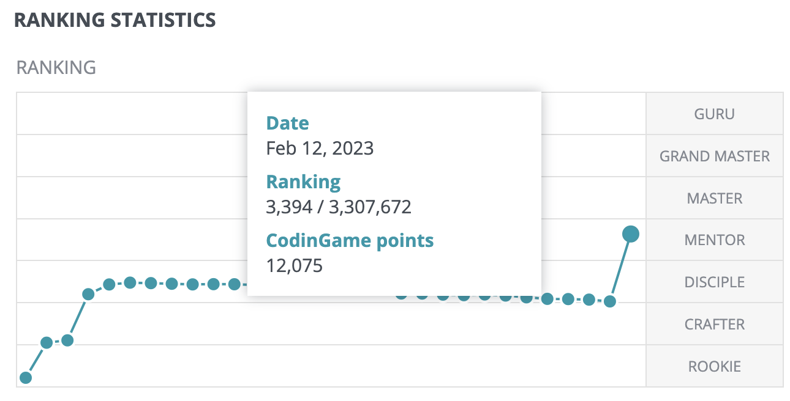
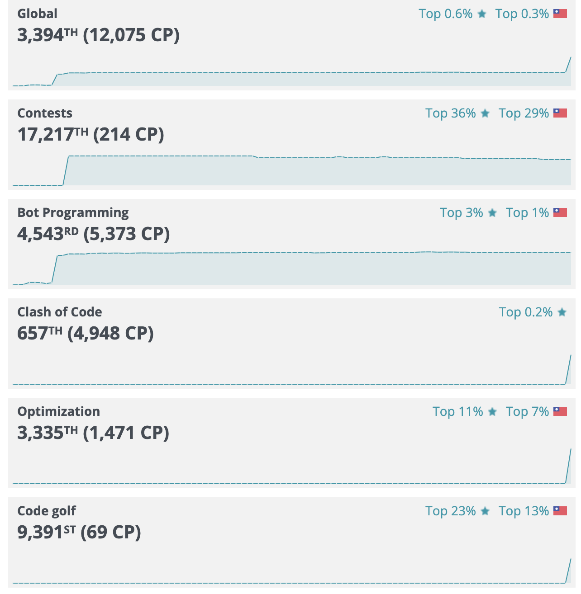
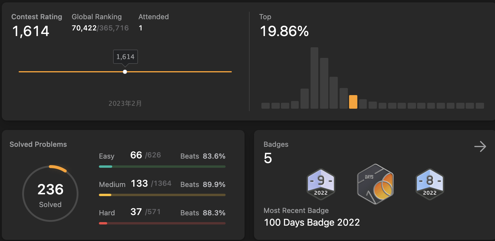
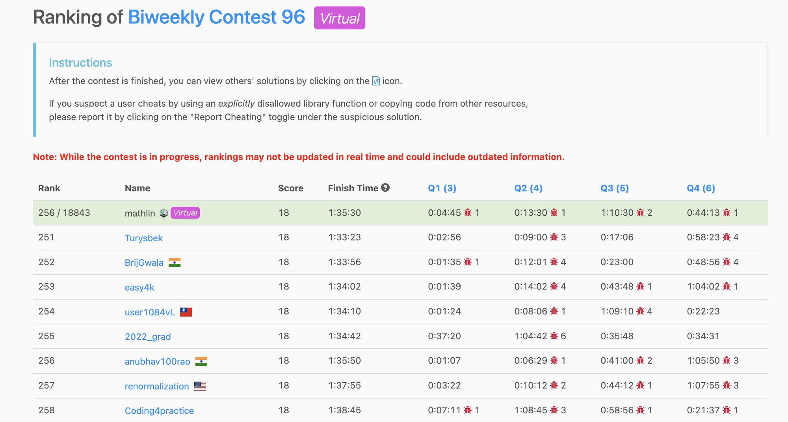
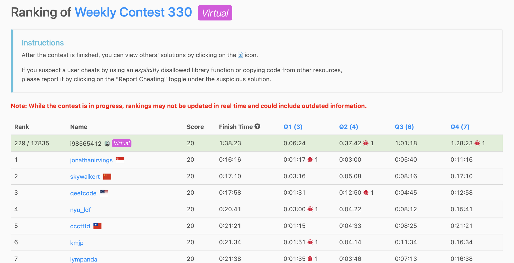

title: About Me
title_en: About Me
lang_en: true
mathjax: true
mermaid: true
comments: false
date: 2025-04-24 00:00:00
---

<!-- LANG:ZH START -->

## 關於我 (About Me)

嗨，大家好～

我是 林育辰 (Owen Lin)，畢業於臺大資工所，目前擔任 Ansys 研發工程師 (R&D Engineer II)，專注於大型語言模型 (LLM) 和 機器學習 (ML) 的創新應用開發，特別是在工程領域的程式碼生成和問答系統頗有研究。

熱衷於技術研究、挑戰性的問題，無論是在軟體開發、程式設計競賽還是在不斷更迭、推陳出新的 LLM 以及 AI 技術探索上，不斷追隨著最新的腳步，也因此，我同時經營了 **[LLM Free Space](https://www.facebook.com/share/g/1BU7EVX2se/)** Facebook Group，定期分享 LLM 新知和技術。

這頁面紀錄了我的相關背景，包括學業、工作、專案和競賽成就，若你/妳對我經歷有興趣，可以細嚼慢嚥，慢慢地看！當然，若有任何合作機會，也能與我聯繫 :)

---

### 🎓 教育背景 (Education)

*   `2022.09 - 2024.06`
     | **國立臺灣大學 (National Taiwan University)**
    *   資訊工程學系 碩士 (Master, Computer Science and Information Engineering - CSIE)
    *   *研究領域*: 多媒體資訊檢索實驗室 (Multimedia Information Retrieval Lab - MIRlab)，專攻自動語音辨識 (Automatic Speech Recognition - ASR)。指導教授：張智星 (Jyh-Shing Roger Jang)
    *   *學業成績*: GPA: 4.27/4.3, Rank: 12/154 (Top 10%)
*   `2018.09 - 2022.06`
     | **國立臺灣師範大學 (National Taiwan Normal University)**
    *   資訊工程學系 學士 (Bachelor, Computer Science and Information Engineering - CSIE)
    *   *學業成績*: Rank: 1/68 (Top 1.47%), 應屆畢業生學業成績優異獎 (Academic Excellence Award)
    *   *榮譽*: 中華民國斐陶斐榮譽學會會員 (Honorary Membership of the Phi Tau Phi Scholastic Honor Society)
*   `2015.09 - 2018.06`
     | **國立宜蘭高級中學 (National Yilan Senior High School)**

---

### 💼 工作經驗 (Experience)

*   `2024.09 - 至今`
    | **Ansys** - **R&D Engineer II**
    >   `2023.07 - 2024.08`
    >  Ansys - Machine Learning Research Intern

    *   領導 機器學習 團隊的研發計畫，特別專注於 LLM 在工程領域的應用。
    *   **主要專案與貢獻**:
        *   **RedHawk-SC Copilot (程式碼生成)**:
            *   🏆 榮獲第二屆 **Tech New Star 科技新秀大賽 (生成式 AI 組) 冠軍**。
            *   開發創新方法 (Semantic Splitter, Data Renovation Framework)，將 LLM 生成程式碼的準確率在中等複雜度任務上提升至 80% 以上。
            *   經 28 位領域專家 (182 票) Arena 評估，效能較 Google CoT 提升 143%。
            *   📜 研究成果發表於 **DAC 2024 (Poster)** 及 **LAD'24 (Oral Presentation)**。
            *   💡 獲得程式碼生成方法相關**專利**。
        *   **RedHawk-SC 領域知識問答系統**:
            *   設計 LLM 優化技術，在內部數據集上將效能指標提升一倍 (3.2 → 6.4/10)。
            *   實作上下文檢索增強 (Contextual Retrieval Augmentation) 以管理企業知識。
        *   **即時語音轉文字 (STT) 系統**:
            *   優化 OpenAI Whisper 架構，達成 6 秒音檔 0.33 秒延遲 (0.0537 RTF)。
            *   將字元錯誤率 (Character Error Rate - CER) 降至 13%。
    *   **技術分享**: 向超過 100 名聽眾 (含高階主管) 進行兩次技術研討會，介紹程式碼生成應用。

    *   參與上述 RedHawk-SC 程式碼生成、問答系統及即時 STT 專案的初期研究與開發。
    *   著重於跟進 LLM 最新技術趨勢，並將其應用於解決工程領域的實際問題。

*   `2021.07 - 2022.06`
     | **KKCompany (KKBOX)** - **後端工程實習生 (Management Associate)**
    *   參與 **Tomorrow Program (MA Program)**。
    *   主要貢獻：
        *   參與內部網站「權限管理系統」的前後端與資料庫設計開發 (Laravel, Vue.js, MySQL)。
        *   與資深工程師合作完成百萬級歌曲轉換 API (Laravel)。
        *   主導正職演算法考題設計 (C++, Algorithm)。
        *   參與設計與啟動公司專案管理流程 (TPM)。

*   `2021.01 - 2021.03`
     | **臺灣國際資訊奧林匹亞競賽 (TOI) 初選** - **命題者 (Question Designer)**

*   `2020.09 - 2021.06`
     | **國立臺灣師範大學 資訊工程學系** - **程式設計課程助教 (Teaching Assistant)**
    *   擔任 C 語言程式設計（一）、（二）課程助教。
    *   負責作業命題 (競賽導向) 與教學輔導。
    *   助教評鑑分數：`4.74 / 5.00`。

---

### 🏆 獎項與榮譽 (Awards & Honors)

*   `2023.11` 🏆 **冠軍 (Championship)** | **Tech New Stars 科技新秀大賽 - 生成式 AI 組**
    *   以 Ansys 專案「適用於工程上的程式碼生成器」參賽，於全國 18 支隊伍中奪冠。
*   `2023.01` 🏆 **第一名 (1st Place)** | **Hahow 課程預測競賽 - 台大深度學習之應用課程**
    *   於 61 支隊伍中，透過模型設計與策略應用獲得第一名。
*   `2022.06` 🏆 **優勝 (Winning Team)** | **玉山人工智慧公開挑戰賽 - 「看見你的聲音」語音辨識後修正**
    *   與隊友開發出符合嚴苛效能限制 (1 秒內處理 10 筆請求) 的模型，於 119 隊中獲獎。
*   `2022.06` **學士班應屆畢業生學業成績優異獎** | 國立臺灣師範大學
*   `2020.10` 🥉 **銅牌 (Bronze Medal)** | **國際大學生程式設計競賽 ACM-ICPC - 臺北區域賽**
*   `2019.10` **第 28 名** | **國際大學生程式設計競賽 ACM-ICPC - 桃園區域賽**
*   `2019.10` **決賽入圍 (Finalist)** | **全國大專電腦軟體設計競賽 NCPC**
*   `2019.06` **第二名 (2nd Place)** | **國立臺灣師範大學 創新教材內容設計競賽**

---

### 💡 代表專案 (Selected Projects)

*   `2022.11 - 2023.01` **字幕生成系統 (Subtitles Generator using WeNet/Whisper)**
    *   台大「數位語音處理概論」期末專題，開發網站讓使用者輸入 YouTube 網址自動生成與嵌入字幕。
    *   初期使用 WeNet Toolkits，後續改用 OpenAI Whisper 以支援多語言並提升辨識率。
    *   [相關報告 (WeNet 版本)](https://nas.mirlab.org/drive/d/s/s9MFwfWTDLFd7bh8WXVKHWJELd8IRcbB/GwnqoIZ2fix53W1RCr4Y2-b-albuet8n-3rYAb5FNLAo)
*   `2020.09 - 2021.06` **應用「迫著空間」加速 MCTS 算法之 5 五將棋研究**
    *   大學畢業專題，研究如何在資源有限下，利用 MCTS (Monte Carlo Tree Search) 結合「迫著空間」(關鍵走步) 提升迷你將棋 (5x5) AI 棋力。
    *   曾獲推薦參加 TCGA 對局競賽。 [GitHub DEMO](https://github.com/yuchen0515/project)
*   `2021.04 - 2021.06` **運用啟發式演算法解決 CodinGame "Coders Strike Back" 遊戲**
    *   「啟發式演算法」課程專案，使用「差分進化」(Differential Evolution) 控制飛船，達到 CodinGame 平台該遊戲的最高級別 **Legend (Top 0.213%)**。
    *   [成果截圖](https://nas.mirlab.org/drive/d/s/rOwtbsjFbgcrzYl9WJYSoRd6ICNNdFAE/BN841xjeu3a1yWX5136jyN-U2ucm_xXU-nrGg971NCAo)
*   `2021.04 - 2021.06` **工作排程系統 (GTD System)**
    *   「資料庫理論」期末專題，開發具備記事、排程與專案管理功能的網站。
    *   技術棧：Vue.js (前端), Node.js (後端), SQL。負責前後端串接、Schema 設計。
    *   獲得課程人氣票選第二名 (2/17)。

---

### 📜 出版物 (Publications)

*   `2024.08` **Y.-C. Lin**, A. Kumar, N. Chang, W. Zhang, M. Zakir, R. Apte, H. He, C. Wang, J.-S. R. Jang. *Novel Preprocessing Technique for Data Embedding in Engineering Code Generation Using Large Language Model*. In Proceedings of the 1st IEEE International Workshop on LLM-Aided Design (LAD'24).
*   `2024.01` J.-Y. Wang, C.-I. Leong, **Y.-C. Lin**, L. Su, & J.-S. R. Jang. *Adapting pretrained speech model for mandarin lyrics transcription and alignment*. In 2023 IEEE Automatic Speech Recognition and Understanding Workshop (ASRU). [DOI](https://doi.org/10.1109/ASRU57964.2023.10389800)
*   `2020.07` Y.-L. Ting, **Y.-C. Lin**, S.-P. Tsai, and Y. Tai. *Using Arduino in Service Learning to Engage Pre-service STEM Teachers into Collaborative Learning*. In Lecture Notes in Computer Science (HCI International 2020). [DOI](https://doi.org/10.1007/978-3-030-50506-6_37)

---

### 🎤 演講與分享 (Talks & Presentations)

*   `2025.05.09` The Secret Life of LLMs: Training, Talking, and Transforming Tech (Software Seminar, ESOBU, Ansys)
*   `2025.04.30` 語言模型的風與雪：一小時速讀 AI 未來 (日月光 ASE)
*   `2025.03.04` LLM Overview (光寶科技 LITEON)
*   `2024.09.19` 探索無限可能：從校園到職場的全方位成長之路 (國立臺灣師範大學 資訊工程學系)
*   `2024.06.30` Novel Preprocessing Technique for Data Embedding in Engineering Code Generation Using Large Language Model (LAD'24 @ IBM Almaden)
*   `2024.04.19` A Novel Data-Preprocessing Technique for Large Lanauge Model Based Domain Specific Code Generation (ESOBU, Ansys)
*   `2023.08.25` My Astonishing Journey with Giants: Building a RedHawk-SC Q&A Assistant by Exploring a Terrifyingly Large Models (Software Seminar, Ansys)

---

### 🏅 證書 (Certifications)

*   `2023.02` 🏆 **Legend** in *Coding Speed* (Top 0.06%) | **CodinGame**
    
*   `2022.06` 🏅 **榮譽會員 (Honorary Membership)** | **中華民國斐陶斐榮譽學會** (The Phi Tau Phi Scholastic Honor Society)
    <a href="http://www.phitauphi.org.tw/rule/rule.htm"><img src="data:image/png;base64,iVBORw0KGgoAAAANSUhEUgAAAHMAAACsCAMAAAB/9WMuAAAAq1BMVEX///8AAAD9/f0MCQO+lQNrVAKIbAPJoAL+2AKnhQP39/c6JwFUNwEgEgBNQgLNy8gUFRKqqKPUqQInHgH/5wktLSratAHW1dQgISC/vbnYwARlYFXx8fFOS0W9oRPe3NrIvZL3ywHKrQM7OTXlugN2dHHRvnCRjond0ZPswwLhzmvn5ufNqRq8pj320A/eyQPi27rw56ChlGLw1jr46F3ixzr289ns0QPguyrr88n4AAASVUlEQVR4nO1c6WKiyhJWmh1kFxUQBUFFVIxJJvP+T3arukEwESczJ/rr1py4sXxdS1dXVRdnMPg/3SYO6PmYA+60XS5PpfokeE6NTqfda3U4i+F5aUbPQCwB8FgEla8IQPPQfjSnXLTYvcrHRJaTj1QURN0dTcPFQ0G5aPsqy56XSKJuCKLIixohZG6qD8RUTx5A+oA0BCJEE0UNPoxnjwPlXjzA5PXhhYigUNCHccqVb57n8aNhh4huIM8P06n64oFgGZdkbNurKUFQZJRsoseAlm+ydzQQcZwvIvAGkQ2oLlVpOHkIJvdy9DwRJbmyqQPiOHUzJkMDpTt9jBmpwKaMPE1tDn0u/kX5eKQLqOHNQxxSBFPTd1GOUeNlOVUNNU1EeeflI4RbvlayAixZC8YmBR2YosALBKfLIzBffqdHVGfItZggcQW80aMUyp1iKcG724MLR2hHB14CPslDfBFgxj5KcYEGG6mU4Od3CX8lq0fIljvxSgx3t8pBud0u18v1+nyeDdTfAUqcPGaCnkRdhLtbJnd6lYvMScF28ui09xPjYY6oFA0dPLo1t3fg6TOeN0bD1eH1KEtozPZD/JB61l2DmksqA1HdjhxwwdRsH+TkTX1EBFg6Rzyu24UAnsB1ZE9CP7F6iEsAR7SxYMEUNME5Ap+VTohrOF6KkNbmQZjcZA6RiK7wAcRDHmAOdfAHCDmcmg9aywaqOQfVaaIi+fKRd0G1oxGLUh61fCLobG4hxEgXlU6EMswfB0lBCYsTGIPs86OU2YDaqzrmu2CO7UdyyUDHGAW5eh2KPTi6rUFn4+lIExSBIk4fFAh9omhyFhVYwBDTCh8YTneIK7eSovA0xJxuHpustKBrRRFcakPjx4ReXwmcvXax2Wdl3Bv3Mk9mT4IcnJuUhYzNp2FqQ4JegYymT+NzwxAx8noa5osi0Jni6uHsWTb0AomviDQCX/skzDdZLlJJguV6Cknhv93jZbcGoi/dd0bsA3zfrpfb7Xa3274AJsR9iou+zzZPprmt6aUh+HTC99PpV0tXy8+bXKXSPgZyYklynBQ+87yTSg7PSxL+AfGSk6YOfHMyDPvkPWZjRIwPlPbxYb/fx/C39539XsIP+5T+EsMvvuM4ijBftJieJ1e+w0sMAQgQFXCp+I/+EsML5ELwDp7WgcgEiDrckYjnINGLFfZNYT/BK/xCvygOr2iE5C2nr4l8hNGBiiRgJObxlacDkChnEuNUkmI4IklpBTHYUTKGxBDxCJ6gsBOYTNiP9Hp438MVPFuH5q3yfzuFfCyCLPUdKQCJOj7+4X9+KqXwt/d9kGua+vAjHCqQT0fQDFzTQBXIpJPS4eBh1IEjpZLvS2kGUkmBGZ4VBcoWk/chbS8yvwpSEHJWVVXhBEFQZQW8ZlVWBb7vw3d4r+AtkZNClgRDUKQ08OFoEBRF4AeOE1R4XoAvfgBjdPAVzpFE6i5XrUJjaV+BtAofjgJ3fq0LnkpYUZicJLAwMCtE8bNCTnzREEQeZIEMAZdoKHAUBgesSr6E/GVZgMMsJBYFd/ncK3wafMBtAh9MxdB1zXU1TYd/8AE/as0vI3gRdEMQREXRyUjDc3V6Irzp9IuB7wY9CW8bZDAWpV77uvrkeRx94CeJol2VuXqJRtPodu+epCGs7zex8LTLJ7NzhU8y41uI3yfILpJEqEc2HbeYsSgKKBFBUdz7t+gy8a2TIOBPLhVCa9zakKK5IKQRgArWdxG/BTnEJIMXLhd1ZEsFChpyDeN72vwmJs1rxDaxIfMWM2xG5brNrSwL/gOajqfTMRC8TBlZFubXgshMkcApU3oiOw9oNZ+H8zGkqi74DKlOFilNN20wbOakxtSaE8ZhuJkBmUCTKzLtfA5ThTmW4Ti3Z3CC2aFJWUblbBPSyev7AmkhO7lUac5r6WpafcZ4M1Gx1vV1UwF+OIOJO/ReJGxO6xA9KzLfP6qkSPyLNqd5N7PhFmbYKKCevat7AcAS1p2U5Q79ye7pvciSRFbIhcvoKs3gFrMVA9V0Zrl3E7wlTOiAypbYas9pnPm7KJKkqNkkqy9ncgt7zFRaa9S6VxsFPqWUYW76UqRo+Q5LgVxPeDK3v57YgJJao5BW3sessKyKfPacU65/40pQV+9XN+NDbpHTUoFba3TcezeGmTWyvX0KtwXILKEDww2D2wyokxDvAlZUl0LuYB543hfv8hlRC/KNL/PympgdNdOFhP2GuzwoaUCl5t7G5NTT76IqajatsNc21Mi2MCfQ6C5Nd329wafE7Na6iclx0a7yg8TX7iizpklON2mY0532FwoA06mEfkywoPfMB21abArcC7tVE1QKU5QJtz+dBcw0Yz6hR7aAWcgO0+YfKtgqOkHiMo32K3R5gGiH3nB6GxPUmWUy794ZVkuTzRSrlRobXz8mBPOUz57dhmgXZM1Emf+pSAbSHZF6ukx7hYs29EFt6DYmijZLHJ2x+cdsUbWnMEXd2n/3Yf6O+eqe3Z6qICvYYjfvNf92yTJDi9Sx33zShwk5hMxueRNT3VaZxOLLO5bYQZ+FVr389IplCSF3cGeuRG8QcLNx35nlHcxyM21WWdyMu495k0/1VyU2cdUdD9rBjOzVBXNyG3MNaVjRyycXvSiX6PJbNSvAxEUNYitC5udlecuOQJ9xLduvbo0rf51phYOaxLd2tLjSRl8E+YigC+L5bC++RgJrCXINFg99xlSjye4NY3RDw0r2vbrKRYYgmFdRFKUP2eMxujeEfPllUsP6mTJ/O72+Jxedtq8QkchyoIgCoK423yjvqi+0WCAnCVZjBMjEiL75XInGNVsWv2By6mL7fqR7TJDeIa+6q23+1AXD/Xrzjp6XKYJguJj36Qa6pPns+rolZKe1T+hgssYQ2ZNE0YAkUoMUyHBhVZndBQVITNpF/RIGQ3hEQa8Hu+X5vf8Zkyt3ACi3cTshlq6PAPReCMmp2GdRaBdESrpObaELupUkhwWRrQ3BMi173od4ldgR3NMn4Z0JA5AgGRapWZrRYFOPH3Z1ugW7LcThFZ/RCbhkkxZWQ3dUJ1GYdZH+RZt2sNCqz9AQYkhuQC7zuYWBw/C6/2DrQNz3ic/ylY2XWGOBj3mlGbJmoGfoA/2FgnUxflGCxKOr/HxWQgQ6wqYHqzO7t1jKoXxOmzVWxSYNg25E2CBjWRJgeo5x/wfsaNgXEXEnOBcHn89+YWOS46JEByXESDQq6wgIbMg5UsxLnXry6nkKbmsvOOydYI0MGxtiHRcu7gtco90rTWhW4HjWcUo/j0s1WuSEYLl22jIKfqgKhCtM8+hlI1znwX5hcns4opU6mMyHRDCQ0dtsvh89nV41UNdKnOFVBC0nmruCcKXRrZPGKT2+qpfYxdaT8YewhFgoqYoPnS6dajTTINcGRu1bmOrpVd7DwRybLJaikirURNAt2oZA+y8uS+E25WPKJ6mXdW6yk2OLKp3jdoVf4H6zVXLqgDtrGmb34S2FRrvjUagDHG6L7WWUT3pDUUT1tJVQsFsnMDp8cub7kcdlBEC4deYUqJhpNMDlQRAQc3Ur5ojeqgAtrETMJSTSYs0n5NFnEaeQe7lsy0s+rSRd+Jy9VwrmOBzFDAK8GDDhm4o9MOxOX2X7Xkl4k2jA0ZYLhrmEAwMO0hMBBdfBzJgNNcNfUpsiaGbc2vfpQcCE5Uo9iLE4vK1Q9d3nQZ0oHcgLJfGCyaGdOij2ls+U96/stlwHOCpScuxsWkQAfSKt+Rgn0eaGQtX3vUOoRjAXPYg8tSGbrqzrDKP2togF8zOj4mtkG0G0ojMUjFzoEHEEqJm1n0HechsTxoMTDMsgXHTg4xhd0pk2oe6OH0a3+LrGwmHXblUwAKo0xITV1WGyRdPgdlTs1i3ZggwUo3ZxgKnwKX47o2yjd7nQu0Us4MSvjGtMKpccKzUQLVHHOAY1AeruiDP3NuZWEAVm7hDUHFiZztrgIVgxgGmSt5hYWKZ8hox31RZF2nUSQXTaxQQhwYDpHLyFaRq0DxIZVQfAJ19LBKQj05G2fmgtSVJ1pc+lKKB/xKidW0q8QzFpfUo9emnXSV5RGerIKIqQGxwgoEHtLmFWb2W5EphTrGkbx8G1PmeiJuDauQI+Z7FCi4ErmJyc+g7+vhXIJ1JtzUV3jKCzA0+b9qZLbgAhB/PY7Uh3fOzUfNaynZyJRi/OJ+VSNFgPSoQz3fP8EVZhbmJyi3CoIRLEErODwPJ7O1osX2m3TjdL26V8doUJgbg7dPGaaW6f6/LdGPzt6c1DGfWwiQ5sBSHXCMs1YVh3eIRb4DLTh9cZ+o6XmHtr7sXRqoCLUYy1asrr0/MWxkt95MruS5XUDThVGlNotMsCRsBD7EC9+VWJB2TbzM9m/CoWelgM1YRCcPFRTnBoVt6fhOJ1rq5DXGsIuJ+Rphhl6JShbjAPa3bt+y6Y2KOKEjJcbYS7IoYhpBDO+yLdPOyRLFK5sWgJAzul4zTABiwWrlrXHR47wKyuMTHPmWNFS9cFLE/jZlNBHSJwad7B5EpW88NtEVit/FipY8dPRU4IIwJqQx1MqlMLUQVYCP0q4BVmh/ch0XY3tGINaYMByUrdIzTOPzV4rHmeuZqO3x/gjMlZxdAwIFlxR3WnxuQPqTYXmfklzWZkQbbyaU3Y4SZjvZZ1D6lmPvp8ca/Fdq9b2F1UyOa+drEAnynT5/g61VMnm3zcJjvj+Wb2nXoCFuc34RyEq7mGoLn5jUx5x2O97wYm9tzE4IZc14KIOp9NFt+CpKnybLkPqhjiE210KzsHTLYsd4PeGhNyHkgGRYOM7fKbgAx1soV5cvyQtNthP8rWv83nAoJ4SJfBZPv9wG0ql7+To0crWe6Npjawodv6pNkZa+Wcbv4Wc3aIMy+hkdR16kkh1riXeguTi96wlRMLmv0utodUbPk6JvW2Tfe+9OOS5/3iqz45LnqRE8i1hbtuvZdRWxSUpkr4JXtcHqS6ljr+hIm1AY+WxL81Mdsr4WUBmKJUF30/u6HBdg/6FG/4BPrch0e3q/4Kk1JknnELnC2FX5pnljGsAF/45LAEAphMJeHfP6lUnmE14+tS4ec5CrIN2PMdXUw1grmJbNKL2izu2x1GCxtckajUa344ucqTl4fYYQX+VWtfNaRcP2yS/z1mZIbuCBbCprHgqhS2BH3S6KHTcKAuENKrn/zAjtzvQrVU5rDgG4pYe+y8yynI1q8xL7EJVqRQskm9wXG/+nWbJrbhkpEgGk001uF0edg7te+b1bu6pzdWJ6xL5sO7+zh9FNEtu5FehwoA2i6joM84bfdXuKh8eZW9LuT4X9gEK6I1ciIoDafGxiwZLGCmbE8HYuioNCGkZIi1zd7ZsvgDoxjeEAQVXNaP4ArnpYm5P/gEn+2vDEN7uX5/xwfr0Ovx7k07/wtQVpgnEAVCZIRdixpEkOf1dvF2zCqZynwkvmfHo1wktObbWPl/eMajrPe4XVERsKnHgLBVF5S9f5TlgmFqafVRVQmFzJrNhn+VLCUzZ5v4YL6iYLCeIEFU0iNORJG2Y6RF8YGInqw0VV+S/6tkKaOzsO55GUHQitVu+IPoNUtg7isuGRoK9kwVIFZJuPSq/scO63KWN402iIoNeNh25if0sUFXE+MqyMB4eKEtFf/npu5y0saOuiCyTr6MNhVKkForfuEVvqK7bXz5E33k5Wbe9hSNdMBRHD8DPsGuDEykdPcSR1vjed63r/d3oHa+uqrQ424ESBhdBek8DkDIdPz3C3UfaGmHn/KJJkNtiWD7UPhXEe19Wpj56nPT1vXmBACuNj+ISFFn+Xza245ljYHHyc93/05MGxuubgOO77Yb/RfUyQxEXC8yGpsehDaBhY/scDYns3A6tYYapP8uw5yHf+o/+AFYc3bGeoPE1pA/7MD9FHGLQ6xILEe6vW//AIrWDsTxdWzyHEjMkSTHqXtcHg5WP1C7jaWqifsejlkjL2Ol5vOZmLEkGc/F3Ma8FD8Z0+QVnkU/T3t+hdsqQt3C8rTndLiZcWmZfRrmsn1W8Hl8Npij/p6xn8a06wXNfd5zV9ysUacbPg3zlAoj4kIarj8NU906vIghvUZ629R+HNMm2GGOte/n2dC6ycCeOFfsuo2lZzv+IZhblz1FQrR7uzU/i/mSgMPFPFh/JqZcSKmvuD9pQ/f/l00c9idkij7q32P8ceJsw9WwpZ3Mn/ZY5IBux9GdsCdFt5QmufW9fsGfpIW9sZ8MOeDum9kf6H8dcqAjyTuQrwAAAABJRU5ErkJggg==" height=15 alt="Phi Tau Phi Logo"></a>
*   `2021.11` 📜 **資訊科技應用學分學程** (Program of Application of Information Technology) | 國立臺灣師範大學
*   `2021.05` 🏅 **專業級 (Professional)**, 排名前 1.1% | **大學程式能力檢定 (CPE)**
    <a href="https://cpe.cse.nsysu.edu.tw/"><img src="data:image/jpeg;base64,/9j/4AAQSkZJRgABAQAAAQABAAD/2wCEAAkGBxIQEA4RDxIQFhASFRYXEBgWEhAQFRUWFRUdGBUXFRMbHSggGR0mGxUWITEhJSorMC4uGCAzODMtNygtLisBCgoKDg0OGxAQGi0lICUtLS0tLy04Ly8vLS8tLS0tLS0tLy0tLS0tLS0tLS0tLS0tLS0tLS0tLS0tLS0tLS0tLf/AABEIAK4BIgMBIgACEQEDEQH/xAAcAAEAAgMBAQEAAAAAAAAAAAAABQYBBAcDAgj/xABJEAABAwICBgILDgUDBQAAAAABAAIDBBEFEgYHEyExQSJRFBcyVGFzgZGTodEWIzM0QlJxcpKisbLS4VNjgsHwJDViFSWDs8L/xAAbAQEAAgMBAQAAAAAAAAAAAAAABAUCAwYBB//EADYRAAIBAgMFBgUDAwUAAAAAAAABAgMRBCExBUFRcZESFFJhsdETMoGh8CIzwQYVcjRCYuHx/9oADAMBAAIRAxEAPwDuKIiAIiIAiIgCIiAIiIAiIgCIoXG690ZY1hs7ifo5D/OpaMRXhQpupPRGynTdSXZiTSLRw6pdJGHyAN8u4jr8C3lspzVSKnHR5mMouLaYREWZiEREAREQBERAEREAREQBERAEREAREQBERAEREAREQBERAFi6Fc1081gbEvp6Jw2guJJeIYebWcs3WeX08MZSUVdkjDYapiJ9imvZeb/PIt2PaVUtEPf5RntuY3pyH+kcPpNlQcV1ryEkUsLGt5OkJkd9lpAHnK5xLKXOLnFzi43cXEuJPWSd5Xyo8q0npkdRh9i4emv1/qfnkunuWSq09xCS96hzR1NayP1gX9a03aU1x41VR6aRQ6LW23vLGOGox0hHovYm49La9vCrn8sjneoqTodY+IR2vKyQdT4g71tylVFAilJbzGeEoTylCPRfxY7TQ6elhY3EaWanLu5dkeWHyEXHkupSlYKyXahzXQHe1zSHNcBwAI9apWjusGORjaXFI2vjPRLy0OFuA2rT3X1h5uan6nR+WiJqcKcXRO6U1OXFzHtPOI9duHPq6krUY11FTd0ne3v5f+WzObq0FRm4uPw5u9ne8Hybzi+d7Xz7JM43X395j7kbnW5n5oUlg7ZRGBL/AE9YHhUPgNZSuhFS1xNyQGu7tjhxZb5w6/LzWKzFZJSAzotvuA339qrXX7vVdevK83pCL3br/wAeee+yjOi5L4MI2S1byz3/APZa0WvSSFzGlwIcRvBFt62FfxkpK6K5qwREXp4EREAREQBERAEREAREQBERAEREAREQBERAEREARFi6ApOszSbsODZRG1RMCAebI+DnfSeA8p5LiRKmtMcXNXWzy3uwOyxeBrdzLfTvPlUKoc5dpnc7Owiw1BR3vN8+H006hEWQL7gsCcYXpFA9/cNkd9VrnfgusaFavI42NmrW55Xb2xkdFgPDOObvUF0KGBrAAxrWtHANAaPMFtjRbWZSYnbtKnLs049rzvZfTW/5Y/Mckbmmzg6/UWlp8xXwv0zXYfFO0tmjje08Q5ocuRaf6D9iA1FLcwE2c03JjJ4b+bb7t+8LydJxz1NmD2xSrz7El2W9M7p+V9epRF3LVdiG2w+NrnXdC50Z33IaDdgP9JA8i4at7CMZnpJM9PI5rudjdpA5OadxCxhPsyuSdo4PvVHsJ2ad1f8AN51PSFkeH18UrhakrHWnA3Bkt/hB1XzXP0OKvcFOxncNaPoH91wfSTTKevhjimZGAx2bMxrmknKW77uI5rrGr7EnVFDCZA7PH724kEZsg6Lt/G7beW62UlTdRySz47yg2hg61PDU51NV+l53T8L6ZP6FoREUkpQiIgCIiAIiIAiIgCIiAIiIAiIgCIiAIiIAiIgCIiAKG0urNhQ1cgNnNicG/WcMrfWQplU7WrJbDJR857G/ev8A2WM3aLZvwsFUrwg98kvucMtvKIEUI+gBW7VhhAqa5pfvZC0yO6i5pAaD/Ub/ANKqK6nqUg6NbJzJY31OPsWdNXkiDtOq6eEm1ra3VpejZ1ALKwFlTDhgtaupWzRSRSC7JGlrh4HCxWyiBOzujkVHqmlJ9+qIw2+7IHOcRfdvNgDZWOh1YULN8m1lP/JwY3zMsfWr0i1qlBbiwqbVxc/97XLL0z+5E0GjtJB8FTQNPXkaXfaNz61KhZRbErEGUpSd5O78wiIhiEREAREQBERAEREAREQBERAEREAREQBERAEREAREQBUjW6P+3f8AmZ+Dld1UNaMGfDKi3yCx33sp9RWM/lZLwDtiqf8AkvU4WFhYWVCO8Mldc1Ln/T1fjG/lXIl1HUpP8dj8W4feB/ELZS+dFZtiLeDl5W9UdTREUs4sIiIAigpceAc4BlwCRfNxsbHl1hfPuh/l/e/ZQJbTwsW4ueay0lu+hIWFrNX7PoT6KA90P8v737J7of5f3v2Xn91wnj+0vY97pW8PoT6KA90P8v737LPuh/l/e/ZP7rhPH9pew7pW8PoTyKGix+M90HN8xUlBUskF2OB/zmFJpYqjVdqck/zhqap0pw+ZWPdFhVKp1g0cb3xu2uZji11o912mxtv6wpUKc5/KrmidWFP5nYtyKm9sih65vR/unbIoeub0f7rZ3Wv4Gau9UfGupckVN7ZFD1zej/dO2RQ9c3o/3TutfwMd6o+NdS5Iqb2yKHrm9H+6dsih65vR/unda/gY71R8a6lyRU3tkUPXN6P91NaPaQQ1zZHQZ7MIDszcu8i+5YzoVYK8otIyjXpzdoyTZMIiLUbgiIgCIiAIiIAiIgCjdIKLsilqoeckb2t+sR0fXZSSwU1PYycWmtUflx3E3433orVrIwQ0tbK4D3qa8kfV0j0m+Rx8xCqqgNWdj6FSqxrQVSOjV/zk8voFa9WWLCmr2B5syYGN3IAvILSf6gB5VVFkGyJ2dxWpKrTlTlo1b85PM/UQWVyzRDWS0MbDX5rjc2YAuuOW0aN9/CPUr5T6R0cguyqpyPHMB8oJuFMjOLRw+IwVehLszi+a0ZLqJ0kxZtHTSzu4tb0B8553MaPKtHEtNKGAEvqGPI+TGRK4+Do7h5bLkmmelsmISAAFkDCdm29zc7ruPN1vMvJ1FFZakjAbNq16ic4tQ3t5X8l+WLngEhdTQOcbucwFx6yTclSCjdG/ilN4sKRXDVv3Jc36lnU+d82FlFvUGFumaXNcAAbb7/5zSlRnVl2YK7NU5xgrydkaKKWdo/Jycw/aH9lH1VK+I2eLdXMH6CtlbCV6KvUg0jGFanPKLueK+oZXMIcwkEL5RaE2ndGxq+TLbhlcJmX4OG5w/v8AQuFY78bqvGyfnK6xgM2WYDk7cfxC5Rjvxqq8bJ+Yr6J/TWJeIpylLVZP3+pyO3KSpuKWl7roaCIi6c58IpSk0dq5mNkip5XRu7lwAsd9t2/wL39yVd3rN5h7Vh8WHFdUZ/Cn4X0ZCIpv3JV3esvmHtT3JV3esvmHtT4sPEuqPfhVPC+jIRdR1QfAVX12/lVI9ydd3rN5h7V0LVjhk1PFUCeN8Zc9paHC1wG23KHjqkHRaTW7euJLwMJqsm4vR7nwLsiIqMvAiIgCIiAIiIAiIgCIiArummjza+mdHuErLugd1OtwPgPA+fkuBVdM+J745GkOaS17TuIIX6eKp+m+hTK9u0js2paNx+S8Dg1/9jyWqrT7Wa1LnZW0lh38Kp8r38H7PecMRbeJ4bLTSOjmje145OHHwtPC3hC1FFOuTTV0whv1lEQ9TaCIiA6to38UpvFhSKjtG/ilN4sKRXI1v3Jc36nO1PnfN+oVm0c+BP1z+AVaVgwCoYyKznNBzHiQOQVhsiSWJu+D/gg41N0suKJxRuORB0DieLbEee3917ur4h8tnnuoTGMVEgyR3y/KPC/gCvcdiqMaEk5J3TSS33IGHo1HUTSepEIiyuOLo2cNPv0X1m/iuX498aqfGyfnK6ng8eaePwG58i5Xjfxup8bJ/wCwruv6QTVOq+L9jl/6ifyLmaKIi7I5k7hoD/ttH9V353KxLjmDafTUsEUDIYnNjBAJLwTck77fSt7toz97xfaeqSrga0ptpLNveXdLHUYwSb3Lc+B1VFyntoz97xfaenbRn73i+09a+4V+C6oz/uFDj9mdWRcpOtGfveL7T10+klL443ncXNa4+UXWmth6lK3bWpuo4mnVv2Hoe6Ii0m8IiIAiIgCIiAIiIAtaurY4I3SzyMjjaLuc9wY0fS47lsrn2uXC5qijpnQxPmjgqY5amJgLnSRNBDgG/K48PDfkgLfhON01W1zqSeGYNNnbN7X5SeF7cF7YliEVNG6WokZHE22Z73BjRc2FyeskBctrq+WWDF58Fwyaml2cQbPszBLLZzdo2Ontxay+8b93XZQWMRVs9BjUUIxKehyUuw7JZK6cz7aMyiMEZi0DNfkLBAdhqRR1zpad5glfFlMjLtc+POLtJtvbcbwVVMT1VU77mnlkjPIECRvn3O9aq2LQYhDLpJLQx1DZHtoMjmRvzOjbFaXZG28jgbbxvWTUYmMOxZ1NPU7PNB2PnNUJWDN78IZqhjHvuPNwCxlCMtUSKGLr0P25tLhu6PI+Ma1cy0jHSyVNIIWkAvkkdEASbC92kDf4V5u1a4hyZG4ciJYretaVVX1skOPwwSYlJsewexmT5pKhgc67rsbexI8trXW/ptieIiprnUoxNskDodgAauSN7RbOY4o4xEGcL53OJvu521/BiT47cxS17L+ntY8YNXtY974xsNowAvbt4i5odfKXNFyAbG30FStFqnqXH32aFg/4l7z5rAetaho6ymr9JH0nZ3ZUkTX0hLXujkDgHSHNlyuewOIYOW8clO6rpax1RIZZal1P2OzaMnFY4ifddzZJ2Nse6uxtwOW6y9VGKEtuYp6WX097kjBh4pWtpw4uEQDcxFr2525L0W1i3w8v1lqricRlVmv+T9WSotyim9WjCyiy2MngL/QCVptcyufNllfeyd813mKyIHng132SslB8Bc80W3DhczuDCB1no/ipihwRrCHSEOcOA5D2qZQ2fXrPKNlxeS92aKmJpwWt+RjAKIsaZHDpO4eAfuuK478aq/GyfnK/Qa/PuO/Gqrxsn5ivoGw6EaEXTjol18/qcnteo6iUnxfoaCIivikCK9aP6vxV00NQahzNoCcuzDrWcRxzDqUj2rG99u9CP1qK8bRi2nLTyfsSlg6zSaj917nNEXS+1Y3vt3oR+tO1Y3vt3oR+ted+oeL7P2Pe41/D917nM3cCv0ThvwEHi2flCoJ1Vjvt3oR+tdBpYcjGMvfK0NvwvYWuoGPr06qj2He1+P8AKJ2Aw9Sk5Oate3Dz4M90RFXFkEREAREQBERAFz6h1rUsj4gaatZFJUdjNmcyMxbb5pLXk8xy5roK5loJqxjgzS4jG19SyqfNBlmlfG0ENLHGPc3MCDxB4BAXyPGqZznMbUU5e0OLgJYyQGGzyRfcATv6kgxmlkjfMyop3Qs+Ee2WNzG2+c8Gw8q5w3VnK7D8YiOwZW1dTJJDKLkmAvY9sT32u1pc11wLjeDvUTpFoTO2kxeoqGQUrZmUzWQ0rZJ2DYOb05GsaDYkcQN17nhvA603H6Qtc8VVMWMDS922iIaHmzCTfcCdw618zaRUbGh76qlawuLQ4zxBpc02c0G+8g8QuK4No7NiUekLKSKmY2oFGIjGySClzRvD5GxlzQd2U33cT4VcdJtBqh76NlDDRtpo6d8bmgRQSNkeDmdtTE92Q5rkNsSb796AvtRjdLHYyVFO27M7c00bbsvYPFzvbfmtXEaihq45qeeSlljyB8zHSRuAj7oPcL9EcCHeVc3ptWVS4UYqWUzxBh09PZzy8Cd0kronNu3gNozfy8i+qbVjURNjETKZjjhc9NOWuy56iUPAc4hvSG9vSPV4EBeMDdhFC2bsSSiiacrpiJ4ybHcwveXE237rnmt6TSOFtS6ndua2DbmYvhEQZmtxzZud72t4VzQappOj7zR7sLdAeHx03tL3PHeOnxW27V7W5SPeLnB20Pwh+GDwfm9zYcfUgOmQYxTP2mSogdsxmlyyxuyNIuHOseiLcys0WL085tBPBIcuazJGSHLe2awPC+665LiGrqSnhqH2jiiOFRwTGBrpHuqWPY6R5ja272nJvdxtyX1qiiL8UqJo4oGwiiijc6CKWKHaXZu6bWkvs0k7uPnQF1xb4eX6y1Ft4t8PL9Zai4TEfvT/AMperOgp/IuS9ArPo38C765/AKsqy6OfAn65/AKfsb/VfRkfHfs/VEusLKLrbsp7GLLKIvAYX59x341VeNk/MV+gl+fcd+NVXjZPzFWey/mlyKzafyR5v0NBERXBTncNAf8AbaP6rvzuVhuuQ4Hp++lp4oGwMcIwQHGRzSbknhl8K3+2lJ3qz0rv0qjq4KvKcmlq3vXHmXlLG0Ywim9y3PhyOn3S65h20pO9Weld+lO2lJ3qz0rv0rX3DEeH7r3M+/0OP2fsdQRcv7aUnerPSu/SpTAdN56t0oZSsOzZnc0SnM4XsQy7bE7+BtdeSwVaKu1lzRlHG0ZOyefJ+xfEWnh9ayoiZLEbseLjkfCCORB3EeBfdRVxxC8r2MHW5zWD1lRmmna2ZJ7Stc2UUfHi8L2vdFI2QMNn7K8xB42ysuVpTaTRM7qOrA6zS1AHraslTm8kmYucVvJ1FC4dpPR1DgyKdm0PBjs0byeoNcASVNLyUZRdpKx7GUZK8XcIiLEyCIiA5PpXrDq6bFKmijfQxRRMY5r54ayUuLmNJHvNz8o8hwVgn1iU9IyFuIFwmfTMma+OJ+xnzAXFPmOYm7u5cARzX1imgZlr56+CuqqeaZjWP2bYiMrQBa7gfmgrwxzVuyuLHVlXUyPigEUBu1hjfdrnTbuLyW7+VuW4IDexvT2CjDTNT1wGzbJIRAMsTXWsHuLgM28Xa0kha2LazqGme9jm1T8kcUrnRwl7RHMAWvLr9EdJt723m29auNasm1cj5J6yoc+SBsMhMdO8nIAM7C5p2RdlBdkte54XXtNq1hc2raZ5f9RSwUzjlZ0WwZbOHhOzF/pQHjX6y4H02IPpTJHLStieeyKaQNLJXtDXtjzBxaQ4WvbiDwXviWs+ipXyxTtqi+AQ7d0cBdG3bMDmuLr7h0gN++5sLrFfq1hm7NzTzDsuCngfYM6LafJlLd3E7IXv1lfWJat4ZxiYM8w7PbTNksGdDsbLly7ueTffrQG3jmsGlo5HNmjq9m3JnmEB2I2lstnuILuPyQVCy6yHGoxiBsLo20MRdHK+KSRpLQS50rQRZp3ZQDdw33XpjequGrkqnvqZgKgR3GzgeWbICwZI5pcxptctaRfdvsLLeqtXzHzYhKKiZra+BsVRGGxlvRjDGvaSLggC9uslAeTtZVNDFT7YTyyupoqioNPTvcyKORoIkkBN2NN72uSAQvXFdZ1BTuc0ipkyxRzZooTI3ZSgFr81xYdIXzW4rVqtWMbg0Q1dTEHUsdJU5RE4TxRNDRfM05XZQBcdX032JtW1OeymsllYyekipA3ouyRxZcpBO8noc+tAfVXUNleZIzdklnMPW1wBB8xXit5mASRNZHGC5kbWsaSWgkMaGgkeRfX/AEab5n3m+1cZXwld1ZtQlq9z4svIVqairyWi9DQVl0c+BP1z+AUT/wBGm+b95vtU1glO6OMteLHMTxB5D2KbsrD1aeJvODSs9U0aMZVhKlaLTzRJoiLpiqCIiAwvz7jnxqr8bJ+Yr9BLjuKaEVz56h7YQWve9zTtIxcOeSOfUVY7OnCEpdppcyu2jCUoxUU3m9CoIrN7gsQ/gt9LF7U9wWIfwW+li9qtO8UfGuqKru9XwPoVlFZvcFiH8FvpYvanuCxD+C30sXtTvFLxrqh3er4H0Kyis3uCxD+C30sXtT3BYh/Bb6WL2p3il411Q7vV8D6FZV61RfGqjxX/ANhRnuCxD+C30kXtVp1eaN1VJPM+ojDWujyg52O35geAPUo+LrU5UZJSTduJIwtGpGtFuLWfAmnmSgmlcyJ8tHM4vIjGZ8Eh7shnFzHHfu4G60sH2VdW10rwHbLYthEkXSY3LclrJB0buvvtfcFdVWMWwGfskVdFM1kpaGyskaXRyAcL23g/5u51UKid08m1a/TXXVK119eJazpuNms0ne3XTk3e3TgbVVQbKannjcbhwikGVgzRv3AHKB3LspHl61OBV5+JVUYG3onOsQS6nkZKLg3vkdld+K136eUjN023id1SQyNP4LF0ak9Ffln6XMlVpwu27c8vUkcfwGGsjIkaBIB73IBZ7HDgQ7jxtuXhoXibqmjifLvlaXMkPW5htfyixUVUaXmrDosMhlklcLZ3NMccd/lEnn4Px4Kd0XwcUdLHBfM4XLz1ucbut4OXkWc4yhS7M9b5J6rW/K+XQxhKM6vahpbN7npbnbMmERFGJIREQBERAEREAREQBERAEREAREQBERAEREAREQBERAEREAREQBERAEREAREQBfDmA7iAR4QCvtEFz4ZGG7mgAeAAL7REAREQH//Z" height=15 alt="CPE Logo"></a>

---

### 👥 其他活動與領導經驗 (Activities & Leadership)

*   `108學年下學期` **總籌 (Coordinator)** | 初階服務學習課程
*   `107學年下學期` **總籌 (Coordinator)** | 「科技奇趣蛋」科技教育活動
*   `107學年下學期` **總籌 (Coordinator)** | 「氛響」期末海師跨校成果發表會
*   `107學年上學期` **總籌 (Coordinator)** | 「航流」期末海師跨校成果發表會

---

### 📞 聯繫方式 (Contact)

*   📧 <u><a href="mailto:i98565412@gmail.com">i98565412@gmail.com</a></u>
*   <a href="https://github.com/yuchen0515" target="_blank"><i class="fa fa-github"></i> GitHub</a> <u>[yuchen0515](https://github.com/yuchen0515)</u>
*   <a href="https://www.linkedin.com/in/mathlin-owen/" target="_blank"><i class="fa fa-brands fa-linkedin"></i> LinkedIn</a> <u>[Yu-Chen Lin](https://www.linkedin.com/in/mathlin-owen/)</u>

---

<!-- LANG:ZH END -->

<!-- LANG:EN START -->

## About Me (English Version)

👋 Hi, I'm **Yu-Chen (Owen) Lin**.

I have a master's degree in Computer Science and Information Engineering from **National Taiwan University (NTU)**. I work as an **R&D Engineer II** at **Ansys**, developing applications of large language models (LLMs) and machine learning (ML), with a focus on code generation and question answering for engineering.

I enjoy technical research and challenging problems, from software development and competitive programming to exploring new LLM and AI techniques. I also run the **[LLM Free Space](https://www.facebook.com/share/g/1BU7EVX2se/)** Facebook group, where I regularly share LLM news and technical insights.

Here you'll find my education, work experience, projects, and competition achievements. Take your time exploring, and feel free to get in touch if you'd like to collaborate!

---

### 🎓 Education

*   `2022.09 - 2024.06`
     | **National Taiwan University (NTU)**
    *   Master's degree in Computer Science and Information Engineering (CSIE)
    *   *Research*: Automatic Speech Recognition (ASR) at the Multimedia Information Retrieval Lab (MIRlab). Advisor: Jyh-Shing Roger Jang
    *   *Academic Performance*: GPA: 4.27/4.3, Rank: 12/154 (Top 10%)
*   `2018.09 - 2022.06`
     | **National Taiwan Normal University (NTNU)**
    *   Bachelor's degree in Computer Science and Information Engineering (CSIE)
    *   *Academic Performance*: Rank: 1/68 (Top 1.47%), Academic Excellence Award for Graduating Class
    *   *Honor*: Honorary member of the Phi Tau Phi Scholastic Honor Society
*   `2015.09 - 2018.06`
     | **National Yilan Senior High School (YLSH)**

---

### 💼 Experience

*   `2024.09 - Present`
    | **Ansys** - **R&D Engineer II**
    >   `2023.07 - 2024.08`
    >   Ansys - Machine Learning Research Intern

    *   Leading R&D projects within the Machine Learning team, focusing on LLM applications for engineering.
    *   **Key Projects & Contributions**:
        *   **RedHawk-SC Copilot (Code Generation)**:
            *   🏆 Won **1st Place** at the 2nd **Tech New Star Competition (Generative AI Track)**.
            *   Developed Semantic Splitter and Data Renovation Framework methods, improving LLM code generation accuracy to ≥80% on tasks of medium complexity.
            *   Improved performance by 143% over Google's chain-of-thought (CoT) prompting in an Arena evaluation by 28 domain experts (182 votes).
            *   📜 Presented the research at **DAC 2024 (Poster)** and **LAD'24 (Oral Presentation)**.
            *   💡 Obtained a **patent** for the code generation method.
        *   **RedHawk-SC Domain-Specific Q&A System**:
            *   Developed LLM optimization techniques that doubled the performance score (3.2 → 6.4/10) on internal datasets.
            *   Implemented contextual retrieval augmentation for enterprise knowledge management.
        *   **Real-Time Speech-to-Text (STT) Pipeline**:
            *   Optimized the OpenAI Whisper architecture, achieving 0.33s latency for 6s of audio (real-time factor, RTF: 0.0537).
            *   Reduced the character error rate (CER) to 13%.
    *   **Technical Sharing**: Delivered two technical seminars to 100+ attendees (including executives) on code generation applications.
    *   Contributed to the initial research and development of the RedHawk-SC code generation, Q&A system, and real-time STT projects mentioned above.
    *   Followed developments in LLMs and applied them to practical engineering problems.

*   `2021.07 - 2022.06`
     | **KKCompany (KKBOX)** - **Backend Engineer Intern (Management Associate)**
    *   Participated in the **Tomorrow Program (MA Program)**.
    *   Key Contributions:
        *   Contributed to the front-end, back-end, and database design and development of an internal permission management system (Laravel, Vue.js, MySQL).
        *   Worked with senior engineers to build a song-conversion API at a million-song scale (Laravel).
        *   Led the design of algorithm questions for full-time engineering interviews (C++, algorithms).
        *   Helped design and introduce the company's project management process (TPM).

*   `2021.01 - 2021.03`
     | **Taiwan Olympiad in Informatics (TOI) Preliminary** - **Question Designer**

*   `2020.09 - 2021.06`
     | **National Taiwan Normal University, CSIE** - **Teaching Assistant (Programming Course)**
    *   Served as a teaching assistant for C Programming (I) & (II).
    *   Designed assignments based on programming contests and tutored students.
    *   TA Evaluation Score: `4.74 / 5.00`.

---

### 🏆 Awards & Honors

*   `2023.11` 🏆 **1st Place** | **Tech New Stars Competition - Generative AI Track**
    *   Won first place among 18 teams nationwide with the Ansys project "Code Generator for Engineering Applications".
*   `2023.01` 🏆 **1st Place** | **Hahow Course Prediction Competition - NTU Deep Learning Application Course**
    *   Placed first among 61 teams through model design and competition strategy.
*   `2022.06` 🏆 **Winning Team** | **E.SUN AI Open Challenge - "See Your Voice" ASR Post-Correction**
    *   Worked with a teammate to develop a model that processed 10 requests within 1 second, earning an award among 119 teams.
*   `2022.06` **Academic Excellence Award for Graduating Class** | National Taiwan Normal University
*   `2020.10` 🥉 **Bronze Medal** | **ACM-ICPC Asia Taipei Regional Contest**
*   `2019.10` **28th Place** | **ACM-ICPC Asia Taoyuan Regional Contest**
*   `2019.10` **Finalist** | **National Collegiate Programming Contest (NCPC)**
*   `2019.06` **2nd Place** | **NTNU Innovative Teaching Material Design Competition**

---

### 💡 Selected Projects

*   `2022.11 - 2023.01` **Subtitle Generator using WeNet/Whisper**
    *   Final project for NTU's "Introduction to Digital Speech Processing" course. Built a website that generates and embeds subtitles from a YouTube URL.
    *   Started with WeNet Toolkits, then switched to OpenAI Whisper for multilingual support and better recognition accuracy.
    *   [Report (WeNet Version)](https://nas.mirlab.org/drive/d/s/s9MFwfWTDLFd7bh8WXVKHWJELd8IRcbB/GwnqoIZ2fix53W1RCr4Y2-b-albuet8n-3rYAb5FNLAo)
*   `2020.09 - 2021.06` **Applying "Threat Space" to Accelerate MCTS Algorithm in 5x5 Shogi (Mini-Shogi)**
    *   Undergraduate capstone project. Researched how to improve Mini-Shogi (5x5) AI under limited resources by combining Monte Carlo Tree Search (MCTS) with "threat space" (critical moves).
    *   Recommended for participation in the TCGA Game Competition. [GitHub DEMO](https://github.com/yuchen0515/project)
*   `2021.04 - 2021.06` **Solving CodinGame "Coders Strike Back" Using a Heuristic Algorithm**
    *   Project for the "Heuristic Algorithms" course. Used Differential Evolution to control spacecraft, reaching the game's highest league, **Legend (Top 0.213%)**, on CodinGame.
    *   [Result Screenshot](https://nas.mirlab.org/drive/d/s/rOwtbsjFbgcrzYl9WJYSoRd6ICNNdFAE/BN841xjeu3a1yWX5136jyN-U2ucm_xXU-nrGg971NCAo)
*   `2021.04 - 2021.06` **Getting Things Done (GTD) System**
    *   Final project for the "Database Theory" course. Built a web application for notes, scheduling, and project management.
    *   Tech Stack: Vue.js (Frontend), Node.js (Backend), SQL. Handled front-end and back-end integration and database schema design.
    *   Placed 2nd out of 17 projects in the course popularity vote (2/17).

---

### 📜 Publications

*   `2024.08` **Y.-C. Lin**, A. Kumar, N. Chang, W. Zhang, M. Zakir, R. Apte, H. He, C. Wang, J.-S. R. Jang. *Novel Preprocessing Technique for Data Embedding in Engineering Code Generation Using Large Language Model*. In Proceedings of the 1st IEEE International Workshop on LLM-Aided Design (LAD'24).
*   `2024.01` J.-Y. Wang, C.-I. Leong, **Y.-C. Lin**, L. Su, & J.-S. R. Jang. *Adapting pretrained speech model for mandarin lyrics transcription and alignment*. In 2023 IEEE Automatic Speech Recognition and Understanding Workshop (ASRU). [DOI](https://doi.org/10.1109/ASRU57964.2023.10389800)
*   `2020.07` Y.-L. Ting, **Y.-C. Lin**, S.-P. Tsai, and Y. Tai. *Using Arduino in Service Learning to Engage Pre-service STEM Teachers into Collaborative Learning*. In Lecture Notes in Computer Science (HCI International 2020). [DOI](https://doi.org/10.1007/978-3-030-50506-6_37)

---

### 🎤 Talks & Presentations

*   `2025.05.09` The Secret Life of LLMs: Training, Talking, and Transforming Tech (Software Seminar, ESOBU, Ansys)
*   `2025.04.30` The Wind and Snow of Language Models: A One-Hour Speed Read of AI's Future (ASE Group)
*   `2025.03.04` LLM Overview (LITEON Technology)
*   `2024.09.19` Exploring Infinite Possibilities: A Comprehensive Growth Path from Campus to Career (Dept. of CSIE, NTNU)
*   `2024.06.30` Novel Preprocessing Technique for Data Embedding in Engineering Code Generation Using Large Language Model (LAD'24 @ IBM Almaden)
*   `2024.04.19` A Novel Data-Preprocessing Technique for Large Language Model Based Domain Specific Code Generation (ESOBU, Ansys)
*   `2023.08.25` My Astonishing Journey with Giants: Building a RedHawk-SC Q&A Assistant by Exploring Terrifyingly Large Models (Software Seminar, Ansys)

---

### 🏅 Certifications

*   `2023.02` 🏆 **Legend** in *Coding Speed* (Top 0.06%) | **CodinGame**
    
*   `2022.06` 🏅 **Honorary Membership** | **The Phi Tau Phi Scholastic Honor Society**
    <a href="http://www.phitauphi.org.tw/rule/rule.htm"><img src="data:image/png;base64,iVBORw0KGgoAAAANSUhEUgAAAHMAAACsCAMAAAB/9WMuAAAAq1BMVEX///8AAAD9/f0MCQO+lQNrVAKIbAPJoAL+2AKnhQP39/c6JwFUNwEgEgBNQgLNy8gUFRKqqKPUqQInHgH/5wktLSratAHW1dQgISC/vbnYwARlYFXx8fFOS0W9oRPe3NrIvZL3ywHKrQM7OTXlugN2dHHRvnCRjond0ZPswwLhzmvn5ufNqRq8pj320A/eyQPi27rw56ChlGLw1jr46F3ixzr289ns0QPguyrr88n4AAASVUlEQVR4nO1c6WKiyhJWmh1kFxUQBUFFVIxJJvP+T3arukEwESczJ/rr1py4sXxdS1dXVRdnMPg/3SYO6PmYA+60XS5PpfokeE6NTqfda3U4i+F5aUbPQCwB8FgEla8IQPPQfjSnXLTYvcrHRJaTj1QURN0dTcPFQ0G5aPsqy56XSKJuCKLIixohZG6qD8RUTx5A+oA0BCJEE0UNPoxnjwPlXjzA5PXhhYigUNCHccqVb57n8aNhh4huIM8P06n64oFgGZdkbNurKUFQZJRsoseAlm+ydzQQcZwvIvAGkQ2oLlVpOHkIJvdy9DwRJbmyqQPiOHUzJkMDpTt9jBmpwKaMPE1tDn0u/kX5eKQLqOHNQxxSBFPTd1GOUeNlOVUNNU1EeeflI4RbvlayAixZC8YmBR2YosALBKfLIzBffqdHVGfItZggcQW80aMUyp1iKcG724MLR2hHB14CPslDfBFgxj5KcYEGG6mU4Od3CX8lq0fIljvxSgx3t8pBud0u18v1+nyeDdTfAUqcPGaCnkRdhLtbJnd6lYvMScF28ui09xPjYY6oFA0dPLo1t3fg6TOeN0bD1eH1KEtozPZD/JB61l2DmksqA1HdjhxwwdRsH+TkTX1EBFg6Rzyu24UAnsB1ZE9CP7F6iEsAR7SxYMEUNME5Ap+VTohrOF6KkNbmQZjcZA6RiK7wAcRDHmAOdfAHCDmcmg9aywaqOQfVaaIi+fKRd0G1oxGLUh61fCLobG4hxEgXlU6EMswfB0lBCYsTGIPs86OU2YDaqzrmu2CO7UdyyUDHGAW5eh2KPTi6rUFn4+lIExSBIk4fFAh9omhyFhVYwBDTCh8YTneIK7eSovA0xJxuHpustKBrRRFcakPjx4ReXwmcvXax2Wdl3Bv3Mk9mT4IcnJuUhYzNp2FqQ4JegYymT+NzwxAx8noa5osi0Jni6uHsWTb0AomviDQCX/skzDdZLlJJguV6Cknhv93jZbcGoi/dd0bsA3zfrpfb7Xa3274AJsR9iou+zzZPprmt6aUh+HTC99PpV0tXy8+bXKXSPgZyYklynBQ+87yTSg7PSxL+AfGSk6YOfHMyDPvkPWZjRIwPlPbxYb/fx/C39539XsIP+5T+EsMvvuM4ijBftJieJ1e+w0sMAQgQFXCp+I/+EsML5ELwDp7WgcgEiDrckYjnINGLFfZNYT/BK/xCvygOr2iE5C2nr4l8hNGBiiRgJObxlacDkChnEuNUkmI4IklpBTHYUTKGxBDxCJ6gsBOYTNiP9Hp438MVPFuH5q3yfzuFfCyCLPUdKQCJOj7+4X9+KqXwt/d9kGua+vAjHCqQT0fQDFzTQBXIpJPS4eBh1IEjpZLvS2kGUkmBGZ4VBcoWk/chbS8yvwpSEHJWVVXhBEFQZQW8ZlVWBb7vw3d4r+AtkZNClgRDUKQ08OFoEBRF4AeOE1R4XoAvfgBjdPAVzpFE6i5XrUJjaV+BtAofjgJ3fq0LnkpYUZicJLAwMCtE8bNCTnzREEQeZIEMAZdoKHAUBgesSr6E/GVZgMMsJBYFd/ncK3wafMBtAh9MxdB1zXU1TYd/8AE/as0vI3gRdEMQREXRyUjDc3V6Irzp9IuB7wY9CW8bZDAWpV77uvrkeRx94CeJol2VuXqJRtPodu+epCGs7zex8LTLJ7NzhU8y41uI3yfILpJEqEc2HbeYsSgKKBFBUdz7t+gy8a2TIOBPLhVCa9zakKK5IKQRgArWdxG/BTnEJIMXLhd1ZEsFChpyDeN72vwmJs1rxDaxIfMWM2xG5brNrSwL/gOajqfTMRC8TBlZFubXgshMkcApU3oiOw9oNZ+H8zGkqi74DKlOFilNN20wbOakxtSaE8ZhuJkBmUCTKzLtfA5ThTmW4Ti3Z3CC2aFJWUblbBPSyev7AmkhO7lUac5r6WpafcZ4M1Gx1vV1UwF+OIOJO/ReJGxO6xA9KzLfP6qkSPyLNqd5N7PhFmbYKKCevat7AcAS1p2U5Q79ye7pvciSRFbIhcvoKs3gFrMVA9V0Zrl3E7wlTOiAypbYas9pnPm7KJKkqNkkqy9ncgt7zFRaa9S6VxsFPqWUYW76UqRo+Q5LgVxPeDK3v57YgJJao5BW3sessKyKfPacU65/40pQV+9XN+NDbpHTUoFba3TcezeGmTWyvX0KtwXILKEDww2D2wyokxDvAlZUl0LuYB543hfv8hlRC/KNL/PympgdNdOFhP2GuzwoaUCl5t7G5NTT76IqajatsNc21Mi2MCfQ6C5Nd329wafE7Na6iclx0a7yg8TX7iizpklON2mY0532FwoA06mEfkywoPfMB21abArcC7tVE1QKU5QJtz+dBcw0Yz6hR7aAWcgO0+YfKtgqOkHiMo32K3R5gGiH3nB6GxPUmWUy794ZVkuTzRSrlRobXz8mBPOUz57dhmgXZM1Emf+pSAbSHZF6ukx7hYs29EFt6DYmijZLHJ2x+cdsUbWnMEXd2n/3Yf6O+eqe3Z6qICvYYjfvNf92yTJDi9Sx33zShwk5hMxueRNT3VaZxOLLO5bYQZ+FVr389IplCSF3cGeuRG8QcLNx35nlHcxyM21WWdyMu495k0/1VyU2cdUdD9rBjOzVBXNyG3MNaVjRyycXvSiX6PJbNSvAxEUNYitC5udlecuOQJ9xLduvbo0rf51phYOaxLd2tLjSRl8E+YigC+L5bC++RgJrCXINFg99xlSjye4NY3RDw0r2vbrKRYYgmFdRFKUP2eMxujeEfPllUsP6mTJ/O72+Jxedtq8QkchyoIgCoK423yjvqi+0WCAnCVZjBMjEiL75XInGNVsWv2By6mL7fqR7TJDeIa+6q23+1AXD/Xrzjp6XKYJguJj36Qa6pPns+rolZKe1T+hgssYQ2ZNE0YAkUoMUyHBhVZndBQVITNpF/RIGQ3hEQa8Hu+X5vf8Zkyt3ACi3cTshlq6PAPReCMmp2GdRaBdESrpObaELupUkhwWRrQ3BMi173od4ldgR3NMn4Z0JA5AgGRapWZrRYFOPH3Z1ugW7LcThFZ/RCbhkkxZWQ3dUJ1GYdZH+RZt2sNCqz9AQYkhuQC7zuYWBw/C6/2DrQNz3ic/ylY2XWGOBj3mlGbJmoGfoA/2FgnUxflGCxKOr/HxWQgQ6wqYHqzO7t1jKoXxOmzVWxSYNg25E2CBjWRJgeo5x/wfsaNgXEXEnOBcHn89+YWOS46JEByXESDQq6wgIbMg5UsxLnXry6nkKbmsvOOydYI0MGxtiHRcu7gtco90rTWhW4HjWcUo/j0s1WuSEYLl22jIKfqgKhCtM8+hlI1znwX5hcns4opU6mMyHRDCQ0dtsvh89nV41UNdKnOFVBC0nmruCcKXRrZPGKT2+qpfYxdaT8YewhFgoqYoPnS6dajTTINcGRu1bmOrpVd7DwRybLJaikirURNAt2oZA+y8uS+E25WPKJ6mXdW6yk2OLKp3jdoVf4H6zVXLqgDtrGmb34S2FRrvjUagDHG6L7WWUT3pDUUT1tJVQsFsnMDp8cub7kcdlBEC4deYUqJhpNMDlQRAQc3Ur5ojeqgAtrETMJSTSYs0n5NFnEaeQe7lsy0s+rSRd+Jy9VwrmOBzFDAK8GDDhm4o9MOxOX2X7Xkl4k2jA0ZYLhrmEAwMO0hMBBdfBzJgNNcNfUpsiaGbc2vfpQcCE5Uo9iLE4vK1Q9d3nQZ0oHcgLJfGCyaGdOij2ls+U96/stlwHOCpScuxsWkQAfSKt+Rgn0eaGQtX3vUOoRjAXPYg8tSGbrqzrDKP2togF8zOj4mtkG0G0ojMUjFzoEHEEqJm1n0HechsTxoMTDMsgXHTg4xhd0pk2oe6OH0a3+LrGwmHXblUwAKo0xITV1WGyRdPgdlTs1i3ZggwUo3ZxgKnwKX47o2yjd7nQu0Us4MSvjGtMKpccKzUQLVHHOAY1AeruiDP3NuZWEAVm7hDUHFiZztrgIVgxgGmSt5hYWKZ8hox31RZF2nUSQXTaxQQhwYDpHLyFaRq0DxIZVQfAJ19LBKQj05G2fmgtSVJ1pc+lKKB/xKidW0q8QzFpfUo9emnXSV5RGerIKIqQGxwgoEHtLmFWb2W5EphTrGkbx8G1PmeiJuDauQI+Z7FCi4ErmJyc+g7+vhXIJ1JtzUV3jKCzA0+b9qZLbgAhB/PY7Uh3fOzUfNaynZyJRi/OJ+VSNFgPSoQz3fP8EVZhbmJyi3CoIRLEErODwPJ7O1osX2m3TjdL26V8doUJgbg7dPGaaW6f6/LdGPzt6c1DGfWwiQ5sBSHXCMs1YVh3eIRb4DLTh9cZ+o6XmHtr7sXRqoCLUYy1asrr0/MWxkt95MruS5XUDThVGlNotMsCRsBD7EC9+VWJB2TbzM9m/CoWelgM1YRCcPFRTnBoVt6fhOJ1rq5DXGsIuJ+Rphhl6JShbjAPa3bt+y6Y2KOKEjJcbYS7IoYhpBDO+yLdPOyRLFK5sWgJAzul4zTABiwWrlrXHR47wKyuMTHPmWNFS9cFLE/jZlNBHSJwad7B5EpW88NtEVit/FipY8dPRU4IIwJqQx1MqlMLUQVYCP0q4BVmh/ch0XY3tGINaYMByUrdIzTOPzV4rHmeuZqO3x/gjMlZxdAwIFlxR3WnxuQPqTYXmfklzWZkQbbyaU3Y4SZjvZZ1D6lmPvp8ca/Fdq9b2F1UyOa+drEAnynT5/g61VMnm3zcJjvj+Wb2nXoCFuc34RyEq7mGoLn5jUx5x2O97wYm9tzE4IZc14KIOp9NFt+CpKnybLkPqhjiE210KzsHTLYsd4PeGhNyHkgGRYOM7fKbgAx1soV5cvyQtNthP8rWv83nAoJ4SJfBZPv9wG0ql7+To0crWe6Npjawodv6pNkZa+Wcbv4Wc3aIMy+hkdR16kkh1riXeguTi96wlRMLmv0utodUbPk6JvW2Tfe+9OOS5/3iqz45LnqRE8i1hbtuvZdRWxSUpkr4JXtcHqS6ljr+hIm1AY+WxL81Mdsr4WUBmKJUF30/u6HBdg/6FG/4BPrch0e3q/4Kk1JknnELnC2FX5pnljGsAF/45LAEAphMJeHfP6lUnmE14+tS4ec5CrIN2PMdXUw1grmJbNKL2izu2x1GCxtckajUa344ucqTl4fYYQX+VWtfNaRcP2yS/z1mZIbuCBbCprHgqhS2BH3S6KHTcKAuENKrn/zAjtzvQrVU5rDgG4pYe+y8yynI1q8xL7EJVqRQskm9wXG/+nWbJrbhkpEgGk001uF0edg7te+b1bu6pzdWJ6xL5sO7+zh9FNEtu5FehwoA2i6joM84bfdXuKh8eZW9LuT4X9gEK6I1ciIoDafGxiwZLGCmbE8HYuioNCGkZIi1zd7ZsvgDoxjeEAQVXNaP4ArnpYm5P/gEn+2vDEN7uX5/xwfr0Ovx7k07/wtQVpgnEAVCZIRdixpEkOf1dvF2zCqZynwkvmfHo1wktObbWPl/eMajrPe4XVERsKnHgLBVF5S9f5TlgmFqafVRVQmFzJrNhn+VLCUzZ5v4YL6iYLCeIEFU0iNORJG2Y6RF8YGInqw0VV+S/6tkKaOzsO55GUHQitVu+IPoNUtg7isuGRoK9kwVIFZJuPSq/scO63KWN402iIoNeNh25if0sUFXE+MqyMB4eKEtFf/npu5y0saOuiCyTr6MNhVKkForfuEVvqK7bXz5E33k5Wbe9hSNdMBRHD8DPsGuDEykdPcSR1vjed63r/d3oHa+uqrQ424ESBhdBek8DkDIdPz3C3UfaGmHn/KJJkNtiWD7UPhXEe19Wpj56nPT1vXmBACuNj+ISFFn+Xza245ljYHHyc93/05MGxuubgOO77Yb/RfUyQxEXC8yGpsehDaBhY/scDYns3A6tYYapP8uw5yHf+o/+AFYc3bGeoPE1pA/7MD9FHGLQ6xILEe6vW//AIrWDsTxdWzyHEjMkSTHqXtcHg5WP1C7jaWqifsejlkjL2Ol5vOZmLEkGc/F3Ma8FD8Z0+QVnkU/T3t+hdsqQt3C8rTndLiZcWmZfRrmsn1W8Hl8Npij/p6xn8a06wXNfd5zV9ysUacbPg3zlAoj4kIarj8NU906vIghvUZ629R+HNMm2GGOte/n2dC6ycCeOFfsuo2lZzv+IZhblz1FQrR7uzU/i/mSgMPFPFh/JqZcSKmvuD9pQ/f/l00c9idkij7q32P8ceJsw9WwpZ3Mn/ZY5IBux9GdsCdFt5QmufW9fsGfpIW9sZ8MOeDum9kf6H8dcqAjyTuQrwAAAABJRU5ErkJggg==" height=15 alt="Phi Tau Phi Logo"></a>
*   `2021.11` 📜 **Program of Application of Information Technology** | National Taiwan Normal University
*   `2021.05` 🏅 **Professional** Level, Top 1.1% | **Collegiate Programming Examination (CPE)**
    <a href="https://cpe.cse.nsysu.edu.tw/"><img src="data:image/jpeg;base64,/9j/4AAQSkZJRgABAQAAAQABAAD/2wCEAAkGBxIQEA4RDxIQFhASFRYXEBgWEhAQFRUWFRUdGBUXFRMbHSggGR0mGxUWITEhJSorMC4uGCAzODMtNygtLisBCgoKDg0OGxAQGi0lICUtLS0tLy04Ly8vLS8tLS0tLS0tLy0tLS0tLS0tLS0tLS0tLS0tLS0tLS0tLS0tLS0tLf/AABEIAK4BIgMBIgACEQEDEQH/xAAcAAEAAgMBAQEAAAAAAAAAAAAABQYBBAcDAgj/xABJEAABAwICBgILDgUDBQAAAAABAAIDBBEFEgYHEyExQSJRFBcyVGFzgZGTodEWIzM0QlJxcpKisbLS4VNjgsHwJDViFSWDs8L/xAAbAQEAAgMBAQAAAAAAAAAAAAAABAUCAwYBB//EADYRAAIBAgMFBgUDAwUAAAAAAAABAgMRBCExBUFRcZESFFJhsdETMoGh8CIzwQYVcjRCYuHx/9oADAMBAAIRAxEAPwDuKIiAIiIAiIgCIiAIiIAiIgCIoXG690ZY1hs7ifo5D/OpaMRXhQpupPRGynTdSXZiTSLRw6pdJGHyAN8u4jr8C3lspzVSKnHR5mMouLaYREWZiEREAREQBERAEREAREQBERAEREAREQBERAEREAREQBERAFi6Fc1081gbEvp6Jw2guJJeIYebWcs3WeX08MZSUVdkjDYapiJ9imvZeb/PIt2PaVUtEPf5RntuY3pyH+kcPpNlQcV1ryEkUsLGt5OkJkd9lpAHnK5xLKXOLnFzi43cXEuJPWSd5Xyo8q0npkdRh9i4emv1/qfnkunuWSq09xCS96hzR1NayP1gX9a03aU1x41VR6aRQ6LW23vLGOGox0hHovYm49La9vCrn8sjneoqTodY+IR2vKyQdT4g71tylVFAilJbzGeEoTylCPRfxY7TQ6elhY3EaWanLu5dkeWHyEXHkupSlYKyXahzXQHe1zSHNcBwAI9apWjusGORjaXFI2vjPRLy0OFuA2rT3X1h5uan6nR+WiJqcKcXRO6U1OXFzHtPOI9duHPq6krUY11FTd0ne3v5f+WzObq0FRm4uPw5u9ne8Hybzi+d7Xz7JM43X395j7kbnW5n5oUlg7ZRGBL/AE9YHhUPgNZSuhFS1xNyQGu7tjhxZb5w6/LzWKzFZJSAzotvuA339qrXX7vVdevK83pCL3br/wAeee+yjOi5L4MI2S1byz3/APZa0WvSSFzGlwIcRvBFt62FfxkpK6K5qwREXp4EREAREQBERAEREAREQBERAEREAREQBERAEREARFi6ApOszSbsODZRG1RMCAebI+DnfSeA8p5LiRKmtMcXNXWzy3uwOyxeBrdzLfTvPlUKoc5dpnc7Owiw1BR3vN8+H006hEWQL7gsCcYXpFA9/cNkd9VrnfgusaFavI42NmrW55Xb2xkdFgPDOObvUF0KGBrAAxrWtHANAaPMFtjRbWZSYnbtKnLs049rzvZfTW/5Y/Mckbmmzg6/UWlp8xXwv0zXYfFO0tmjje08Q5ocuRaf6D9iA1FLcwE2c03JjJ4b+bb7t+8LydJxz1NmD2xSrz7El2W9M7p+V9epRF3LVdiG2w+NrnXdC50Z33IaDdgP9JA8i4at7CMZnpJM9PI5rudjdpA5OadxCxhPsyuSdo4PvVHsJ2ad1f8AN51PSFkeH18UrhakrHWnA3Bkt/hB1XzXP0OKvcFOxncNaPoH91wfSTTKevhjimZGAx2bMxrmknKW77uI5rrGr7EnVFDCZA7PH724kEZsg6Lt/G7beW62UlTdRySz47yg2hg61PDU51NV+l53T8L6ZP6FoREUkpQiIgCIiAIiIAiIgCIiAIiIAiIgCIiAIiIAiIgCIiAKG0urNhQ1cgNnNicG/WcMrfWQplU7WrJbDJR857G/ev8A2WM3aLZvwsFUrwg98kvucMtvKIEUI+gBW7VhhAqa5pfvZC0yO6i5pAaD/Ub/ANKqK6nqUg6NbJzJY31OPsWdNXkiDtOq6eEm1ra3VpejZ1ALKwFlTDhgtaupWzRSRSC7JGlrh4HCxWyiBOzujkVHqmlJ9+qIw2+7IHOcRfdvNgDZWOh1YULN8m1lP/JwY3zMsfWr0i1qlBbiwqbVxc/97XLL0z+5E0GjtJB8FTQNPXkaXfaNz61KhZRbErEGUpSd5O78wiIhiEREAREQBERAEREAREQBERAEREAREQBERAEREAREQBUjW6P+3f8AmZ+Dld1UNaMGfDKi3yCx33sp9RWM/lZLwDtiqf8AkvU4WFhYWVCO8Mldc1Ln/T1fjG/lXIl1HUpP8dj8W4feB/ELZS+dFZtiLeDl5W9UdTREUs4sIiIAigpceAc4BlwCRfNxsbHl1hfPuh/l/e/ZQJbTwsW4ueay0lu+hIWFrNX7PoT6KA90P8v737J7of5f3v2Xn91wnj+0vY97pW8PoT6KA90P8v737LPuh/l/e/ZP7rhPH9pew7pW8PoTyKGix+M90HN8xUlBUskF2OB/zmFJpYqjVdqck/zhqap0pw+ZWPdFhVKp1g0cb3xu2uZji11o912mxtv6wpUKc5/KrmidWFP5nYtyKm9sih65vR/unbIoeub0f7rZ3Wv4Gau9UfGupckVN7ZFD1zej/dO2RQ9c3o/3TutfwMd6o+NdS5Iqb2yKHrm9H+6dsih65vR/unda/gY71R8a6lyRU3tkUPXN6P91NaPaQQ1zZHQZ7MIDszcu8i+5YzoVYK8otIyjXpzdoyTZMIiLUbgiIgCIiAIiIAiIgCjdIKLsilqoeckb2t+sR0fXZSSwU1PYycWmtUflx3E3433orVrIwQ0tbK4D3qa8kfV0j0m+Rx8xCqqgNWdj6FSqxrQVSOjV/zk8voFa9WWLCmr2B5syYGN3IAvILSf6gB5VVFkGyJ2dxWpKrTlTlo1b85PM/UQWVyzRDWS0MbDX5rjc2YAuuOW0aN9/CPUr5T6R0cguyqpyPHMB8oJuFMjOLRw+IwVehLszi+a0ZLqJ0kxZtHTSzu4tb0B8553MaPKtHEtNKGAEvqGPI+TGRK4+Do7h5bLkmmelsmISAAFkDCdm29zc7ruPN1vMvJ1FFZakjAbNq16ic4tQ3t5X8l+WLngEhdTQOcbucwFx6yTclSCjdG/ilN4sKRXDVv3Jc36lnU+d82FlFvUGFumaXNcAAbb7/5zSlRnVl2YK7NU5xgrydkaKKWdo/Jycw/aH9lH1VK+I2eLdXMH6CtlbCV6KvUg0jGFanPKLueK+oZXMIcwkEL5RaE2ndGxq+TLbhlcJmX4OG5w/v8AQuFY78bqvGyfnK6xgM2WYDk7cfxC5Rjvxqq8bJ+Yr6J/TWJeIpylLVZP3+pyO3KSpuKWl7roaCIi6c58IpSk0dq5mNkip5XRu7lwAsd9t2/wL39yVd3rN5h7Vh8WHFdUZ/Cn4X0ZCIpv3JV3esvmHtT3JV3esvmHtT4sPEuqPfhVPC+jIRdR1QfAVX12/lVI9ydd3rN5h7V0LVjhk1PFUCeN8Zc9paHC1wG23KHjqkHRaTW7euJLwMJqsm4vR7nwLsiIqMvAiIgCIiAIiIAiIgCIiArummjza+mdHuErLugd1OtwPgPA+fkuBVdM+J745GkOaS17TuIIX6eKp+m+hTK9u0js2paNx+S8Dg1/9jyWqrT7Wa1LnZW0lh38Kp8r38H7PecMRbeJ4bLTSOjmje145OHHwtPC3hC1FFOuTTV0whv1lEQ9TaCIiA6to38UpvFhSKjtG/ilN4sKRXI1v3Jc36nO1PnfN+oVm0c+BP1z+AVaVgwCoYyKznNBzHiQOQVhsiSWJu+D/gg41N0suKJxRuORB0DieLbEee3917ur4h8tnnuoTGMVEgyR3y/KPC/gCvcdiqMaEk5J3TSS33IGHo1HUTSepEIiyuOLo2cNPv0X1m/iuX498aqfGyfnK6ng8eaePwG58i5Xjfxup8bJ/wCwruv6QTVOq+L9jl/6ifyLmaKIi7I5k7hoD/ttH9V353KxLjmDafTUsEUDIYnNjBAJLwTck77fSt7toz97xfaeqSrga0ptpLNveXdLHUYwSb3Lc+B1VFyntoz97xfaenbRn73i+09a+4V+C6oz/uFDj9mdWRcpOtGfveL7T10+klL443ncXNa4+UXWmth6lK3bWpuo4mnVv2Hoe6Ii0m8IiIAiIgCIiAIiIAtaurY4I3SzyMjjaLuc9wY0fS47lsrn2uXC5qijpnQxPmjgqY5amJgLnSRNBDgG/K48PDfkgLfhON01W1zqSeGYNNnbN7X5SeF7cF7YliEVNG6WokZHE22Z73BjRc2FyeskBctrq+WWDF58Fwyaml2cQbPszBLLZzdo2Ontxay+8b93XZQWMRVs9BjUUIxKehyUuw7JZK6cz7aMyiMEZi0DNfkLBAdhqRR1zpad5glfFlMjLtc+POLtJtvbcbwVVMT1VU77mnlkjPIECRvn3O9aq2LQYhDLpJLQx1DZHtoMjmRvzOjbFaXZG28jgbbxvWTUYmMOxZ1NPU7PNB2PnNUJWDN78IZqhjHvuPNwCxlCMtUSKGLr0P25tLhu6PI+Ma1cy0jHSyVNIIWkAvkkdEASbC92kDf4V5u1a4hyZG4ciJYretaVVX1skOPwwSYlJsewexmT5pKhgc67rsbexI8trXW/ptieIiprnUoxNskDodgAauSN7RbOY4o4xEGcL53OJvu521/BiT47cxS17L+ntY8YNXtY974xsNowAvbt4i5odfKXNFyAbG30FStFqnqXH32aFg/4l7z5rAetaho6ymr9JH0nZ3ZUkTX0hLXujkDgHSHNlyuewOIYOW8clO6rpax1RIZZal1P2OzaMnFY4ifddzZJ2Nse6uxtwOW6y9VGKEtuYp6WX097kjBh4pWtpw4uEQDcxFr2525L0W1i3w8v1lqricRlVmv+T9WSotyim9WjCyiy2MngL/QCVptcyufNllfeyd813mKyIHng132SslB8Bc80W3DhczuDCB1no/ipihwRrCHSEOcOA5D2qZQ2fXrPKNlxeS92aKmJpwWt+RjAKIsaZHDpO4eAfuuK478aq/GyfnK/Qa/PuO/Gqrxsn5ivoGw6EaEXTjol18/qcnteo6iUnxfoaCIivikCK9aP6vxV00NQahzNoCcuzDrWcRxzDqUj2rG99u9CP1qK8bRi2nLTyfsSlg6zSaj917nNEXS+1Y3vt3oR+tO1Y3vt3oR+ted+oeL7P2Pe41/D917nM3cCv0ThvwEHi2flCoJ1Vjvt3oR+tdBpYcjGMvfK0NvwvYWuoGPr06qj2He1+P8AKJ2Aw9Sk5Oate3Dz4M90RFXFkEREAREQBERAFz6h1rUsj4gaatZFJUdjNmcyMxbb5pLXk8xy5roK5loJqxjgzS4jG19SyqfNBlmlfG0ENLHGPc3MCDxB4BAXyPGqZznMbUU5e0OLgJYyQGGzyRfcATv6kgxmlkjfMyop3Qs+Ee2WNzG2+c8Gw8q5w3VnK7D8YiOwZW1dTJJDKLkmAvY9sT32u1pc11wLjeDvUTpFoTO2kxeoqGQUrZmUzWQ0rZJ2DYOb05GsaDYkcQN17nhvA603H6Qtc8VVMWMDS922iIaHmzCTfcCdw618zaRUbGh76qlawuLQ4zxBpc02c0G+8g8QuK4No7NiUekLKSKmY2oFGIjGySClzRvD5GxlzQd2U33cT4VcdJtBqh76NlDDRtpo6d8bmgRQSNkeDmdtTE92Q5rkNsSb796AvtRjdLHYyVFO27M7c00bbsvYPFzvbfmtXEaihq45qeeSlljyB8zHSRuAj7oPcL9EcCHeVc3ptWVS4UYqWUzxBh09PZzy8Cd0kronNu3gNozfy8i+qbVjURNjETKZjjhc9NOWuy56iUPAc4hvSG9vSPV4EBeMDdhFC2bsSSiiacrpiJ4ybHcwveXE237rnmt6TSOFtS6ndua2DbmYvhEQZmtxzZud72t4VzQappOj7zR7sLdAeHx03tL3PHeOnxW27V7W5SPeLnB20Pwh+GDwfm9zYcfUgOmQYxTP2mSogdsxmlyyxuyNIuHOseiLcys0WL085tBPBIcuazJGSHLe2awPC+665LiGrqSnhqH2jiiOFRwTGBrpHuqWPY6R5ja272nJvdxtyX1qiiL8UqJo4oGwiiijc6CKWKHaXZu6bWkvs0k7uPnQF1xb4eX6y1Ft4t8PL9Zai4TEfvT/AMperOgp/IuS9ArPo38C765/AKsqy6OfAn65/AKfsb/VfRkfHfs/VEusLKLrbsp7GLLKIvAYX59x341VeNk/MV+gl+fcd+NVXjZPzFWey/mlyKzafyR5v0NBERXBTncNAf8AbaP6rvzuVhuuQ4Hp++lp4oGwMcIwQHGRzSbknhl8K3+2lJ3qz0rv0qjq4KvKcmlq3vXHmXlLG0Ywim9y3PhyOn3S65h20pO9Weld+lO2lJ3qz0rv0rX3DEeH7r3M+/0OP2fsdQRcv7aUnerPSu/SpTAdN56t0oZSsOzZnc0SnM4XsQy7bE7+BtdeSwVaKu1lzRlHG0ZOyefJ+xfEWnh9ayoiZLEbseLjkfCCORB3EeBfdRVxxC8r2MHW5zWD1lRmmna2ZJ7Stc2UUfHi8L2vdFI2QMNn7K8xB42ysuVpTaTRM7qOrA6zS1AHraslTm8kmYucVvJ1FC4dpPR1DgyKdm0PBjs0byeoNcASVNLyUZRdpKx7GUZK8XcIiLEyCIiA5PpXrDq6bFKmijfQxRRMY5r54ayUuLmNJHvNz8o8hwVgn1iU9IyFuIFwmfTMma+OJ+xnzAXFPmOYm7u5cARzX1imgZlr56+CuqqeaZjWP2bYiMrQBa7gfmgrwxzVuyuLHVlXUyPigEUBu1hjfdrnTbuLyW7+VuW4IDexvT2CjDTNT1wGzbJIRAMsTXWsHuLgM28Xa0kha2LazqGme9jm1T8kcUrnRwl7RHMAWvLr9EdJt723m29auNasm1cj5J6yoc+SBsMhMdO8nIAM7C5p2RdlBdkte54XXtNq1hc2raZ5f9RSwUzjlZ0WwZbOHhOzF/pQHjX6y4H02IPpTJHLStieeyKaQNLJXtDXtjzBxaQ4WvbiDwXviWs+ipXyxTtqi+AQ7d0cBdG3bMDmuLr7h0gN++5sLrFfq1hm7NzTzDsuCngfYM6LafJlLd3E7IXv1lfWJat4ZxiYM8w7PbTNksGdDsbLly7ueTffrQG3jmsGlo5HNmjq9m3JnmEB2I2lstnuILuPyQVCy6yHGoxiBsLo20MRdHK+KSRpLQS50rQRZp3ZQDdw33XpjequGrkqnvqZgKgR3GzgeWbICwZI5pcxptctaRfdvsLLeqtXzHzYhKKiZra+BsVRGGxlvRjDGvaSLggC9uslAeTtZVNDFT7YTyyupoqioNPTvcyKORoIkkBN2NN72uSAQvXFdZ1BTuc0ipkyxRzZooTI3ZSgFr81xYdIXzW4rVqtWMbg0Q1dTEHUsdJU5RE4TxRNDRfM05XZQBcdX032JtW1OeymsllYyekipA3ouyRxZcpBO8noc+tAfVXUNleZIzdklnMPW1wBB8xXit5mASRNZHGC5kbWsaSWgkMaGgkeRfX/AEab5n3m+1cZXwld1ZtQlq9z4svIVqairyWi9DQVl0c+BP1z+AUT/wBGm+b95vtU1glO6OMteLHMTxB5D2KbsrD1aeJvODSs9U0aMZVhKlaLTzRJoiLpiqCIiAwvz7jnxqr8bJ+Yr9BLjuKaEVz56h7YQWve9zTtIxcOeSOfUVY7OnCEpdppcyu2jCUoxUU3m9CoIrN7gsQ/gt9LF7U9wWIfwW+li9qtO8UfGuqKru9XwPoVlFZvcFiH8FvpYvanuCxD+C30sXtTvFLxrqh3er4H0Kyis3uCxD+C30sXtT3BYh/Bb6WL2p3il411Q7vV8D6FZV61RfGqjxX/ANhRnuCxD+C30kXtVp1eaN1VJPM+ojDWujyg52O35geAPUo+LrU5UZJSTduJIwtGpGtFuLWfAmnmSgmlcyJ8tHM4vIjGZ8Eh7shnFzHHfu4G60sH2VdW10rwHbLYthEkXSY3LclrJB0buvvtfcFdVWMWwGfskVdFM1kpaGyskaXRyAcL23g/5u51UKid08m1a/TXXVK119eJazpuNms0ne3XTk3e3TgbVVQbKannjcbhwikGVgzRv3AHKB3LspHl61OBV5+JVUYG3onOsQS6nkZKLg3vkdld+K136eUjN023id1SQyNP4LF0ak9Ffln6XMlVpwu27c8vUkcfwGGsjIkaBIB73IBZ7HDgQ7jxtuXhoXibqmjifLvlaXMkPW5htfyixUVUaXmrDosMhlklcLZ3NMccd/lEnn4Px4Kd0XwcUdLHBfM4XLz1ucbut4OXkWc4yhS7M9b5J6rW/K+XQxhKM6vahpbN7npbnbMmERFGJIREQBERAEREAREQBERAEREAREQBERAEREAREQBERAEREAREQBERAEREAREQBfDmA7iAR4QCvtEFz4ZGG7mgAeAAL7REAREQH//Z" height=15 alt="CPE Logo"></a>

---

### 👥 Activities & Leadership

*   `Spring 2020` **Coordinator** | Introductory Service Learning Course
*   `Spring 2019` **Coordinator** | "Tech Fun Egg" Technology Education Event
*   `Spring 2019` **Coordinator** | "FenXiang" Joint University End-of-Term Showcase
*   `Fall 2018` **Coordinator** | "HangLiu" Joint University End-of-Term Showcase

---

### 📞 Contact

*   📧 <u><a href="mailto:i98565412@gmail.com">i98565412@gmail.com</a></u>
*   <a href="https://github.com/yuchen0515" target="_blank"><i class="fa fa-github"></i> GitHub</a> <u>[yuchen0515](https://github.com/yuchen0515)</u>
*   <a href="https://www.linkedin.com/in/mathlin-owen/" target="_blank"><i class="fa fa-brands fa-linkedin"></i> LinkedIn</a> <u>[Yu-Chen Lin](https://www.linkedin.com/in/mathlin-owen/)</u>

---

<!-- LANG:EN END -->

## 程式相關活動 (Programming Activities)

以下會放一些我平常有時會玩的程式相關網站的概況，如 CodinGame, Leetcode 等，因為太過零碎，因此放在自介頁面最底端，有興趣的同學也歡迎交流！

### CodinGame [<a href="https://www.codingame.com/start" target="_blank">URL</a>] 

> CodinGame 是一個能用程式玩遊戲的平台，有很多不同類型的遊戲，如：Bot Programming 是用程式撰寫演算法去控制遊戲中的元素，和他人對戰的遊戲、Code Speed 則是有個叫做 Clash of Code 的 battle 遊戲，多名玩家同時給定一道題目，比較誰最快解出的遊戲。諸如此類有許多種不同的遊戲，在這平台上有相當多玩家在進行，能在某種程度上檢核自己的能力，另一方面又可以從程式玩遊戲的過程中獲得樂趣XD

##### 
Table

| Type | Title | Level | Rank | Top |
| :--: | :--: | :--: | :--: | :--:|
| Code Speed | [Clash of Code](https://www.codingame.com/multiplayer/clashofcode) | <b>Legend</b>  | **347** / 526,665 | **0.06** % |
| Bot Programming | [Mad Pod Racing](https://www.codingame.com/multiplayer/bot-programming/mad-pod-racing) | <b>Legend</b> |  **503** / 173,852 | **0.29** % |
| Bot Programming | [Spring Challenge 2021](https://www.codingame.com/multiplayer/bot-programming/spring-challenge-2021) | <b>Silver</b> |  **3,044** / 8,045 | 37.84 % |
| Bot Programming | [Legends of Code & Magic](https://www.codingame.com/multiplayer/bot-programming/legends-of-code-magic) | <b>Bronze</b> |  **868** / 2,600 | 33.38 % |
| Optimization | [Code vs Zombies](https://www.codingame.com/multiplayer/optimization/code-vs-zombies) |  <b>Gold</b>  | **1,359** / 16,827 | 8.08 %|

(Update at 2023.02.12)

 

    <h5>Line Chart - Ranking</h5>
    
     
    (Update at 2023.02.12)

     
    <h5>Line Chart - Pts Ranking</h5>
    
     
    (Update at 2023.02.12)

> 要在 CodinGame 任一項目得到 Legend 有一定難度，但遊戲太有趣會令人欲罷不能，推薦可以玩玩看！排名這塊是採用分數累積制，因此該項目玩的少積分就會低了，蠻推薦可以玩玩看！

### LeetCode [<a href="https://leetcode.com/mathlin/" target="_blank">URL</a>] 

> Leetcode 上有許多實際面試時出現過的題目可供人解題，除了一般解題外，也有雙週賽、單週賽等等，我個人有時會心血來潮寫個幾題 (但我不太愛刷題XD)，競賽則只有參加一場，他是採用 [Elo](https://zh.wikipedia.org/zh-tw/%E7%AD%89%E7%B4%9A%E5%88%86) 等級分計算的，會在多次參賽中逐步調整到最和你相匹配的分數。

###### Vitual Contest
> Leetcode 可以模擬過去的比賽，和真實比賽完全一樣，在 90 分鐘內有四道題目，最後會結算出排行榜，有不小的參考價值！可以用這個來模擬臨場反應。

**
Biweekly Contest 96 (256 / 18,843, Top 1.36 %)
**

**
Weekly Contest 330 (229 / 17,835, Top 1.28 %)
**

