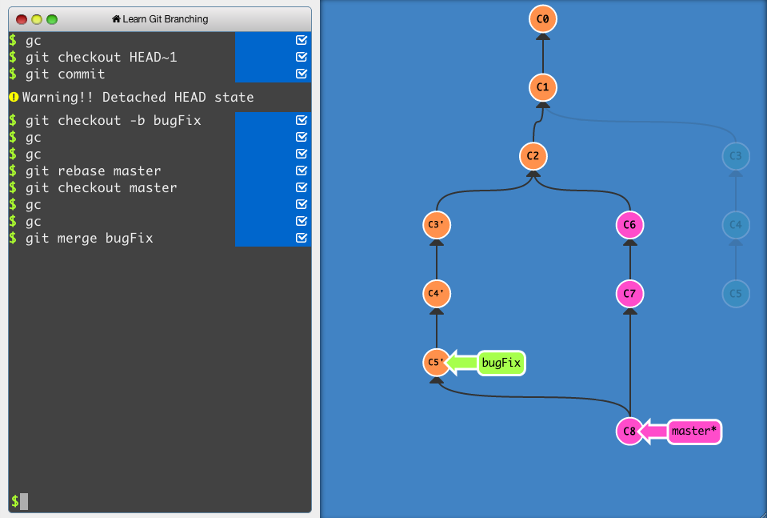
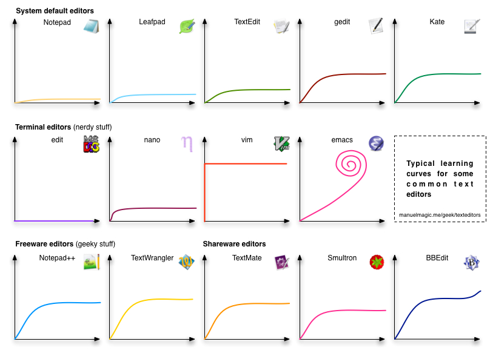

title: Useful Links
title_en: Useful Links
lang_en: true
mathjax: true
mermaid: true
date: 2023-04-02 00:00:00
---

<!-- LANG:ZH START -->
> 此頁面記載了許多當初對我幫助極大的連結，期望能將那些曾經幫助到我的連結彙整起來，以幫助更多人！當然，若你有私藏的相關連結也請留言分享給我唷 :)

---

## 大型語言模型 (LLM)

> 首先，先來推銷一下我自己經營的社團～ Facebook "LLM Free Space"，主要以分享 LLM 相關新知為主，包括超酷的 MCP demo、天氣介面實作、技術論文等等，包山包海的啦！
* [LLM Free Space](https://www.facebook.com/share/g/18Pko9vWrR/)

## 程式／演算法

#### 互動式學習網站
* [Snakify](https://snakify.org/en/) 
  <i class="el-icon-collection-tag"></i>tags: `Python` `JavaScript`
  > Python & JS 的基礎語法題目以及教學，每個基礎概念都有影片和文字講解，很適合初學者學習。這也是我剛開始學習 Python 所使用的網站～
* [Kaggle](https://www.kaggle.com/)
  <i class="el-icon-collection-tag"></i>tags: `Python` `ML` `DL` `Competition`
  > 作為 機器學習 與 資料探勘 的工程師，不可能不知道的網站之一！對於 Python, ML, DL 都有詳盡的教學，也有實作，其上有雲端環境可直接在遠端主機上運行，不用吃到本機的資源。另外有很多競賽，像是數據預測、辨識等等，附有獎金與面試等機會。
* [W3Schools](https://www.w3schools.com/)
  <i class="el-icon-collection-tag"></i>tags: `Web language` `SQL` `Data Analysis`
  > 有各種程式語言、數據分析套件和資料庫等教學，先是基礎概念講解，而後有填空、互動練習。
* [picoCTF](https://picoctf.org/)
  <i class="el-icon-collection-tag"></i>tags: `CTF`
  > CTF (Capture The Flag) 奪旗賽，又稱資安攻防賽。該網站係美國提供給高中生練習 CTF 的網站，以 RPG 方式進行，非常容易上手，值得一試！
* [R語言翻轉教室](https://datascienceandr.org/)
  <i class="el-icon-collection-tag"></i>tags: `R`
  > 由 台大教授 Wush Wu 所建置的網站，其目的在於能夠在 R 語言的編譯器中同時使用教學系統，學習與實作都在本機上進行。個人以往上課時有使用過，難度由淺入深，很適合學習。
* [HackerRank](https://www.hackerrank.com)
  <i class="el-icon-collection-tag"></i>tags: `Algorithm` `Data Structure` `AI` `Programming Language`
  > 主題式的 線上評測系統 (Online Judge)，包含演算法、資料結構、人工智慧和不同語言，個人感想是蠻像 Leetcode 的，亦可以爭取排名。
* [CodinGame](https://www.codingame.com/start)
  <i class="el-icon-collection-tag"></i>tags: `Game` `ML` `Programming Language`
  > 平台上有很多款不同的遊戲，每個遊戲係由程式所控制，你會控制你的角色和其他玩家對決，其中有不同階段，木頭3, 2, 1, 銅牌, 銀牌, 金牌和傳說七種階段，成為該階段的第一名並打敗 Boss 後才可升到下一階段。每季還有特別的遊戲，非常好玩，可以嘗試看看用程式玩遊戲的學習方式～

#### 教學網站
* [Node 入門](https://www.nodebeginner.org/index-zh-tw.html#execution-in-the-kongdom-of-verbs)
  <i class="el-icon-collection-tag"></i>tags: `Node.js`
  > 以實務的方式學習 Node.js，按照文章學習與實作後，便能建立一個可實際應用的網站，是一個很詳盡概念很清晰的網站，非常推薦！
* [演算法筆記](https://web.ntnu.edu.tw/~algo/) 
  <i class="el-icon-collection-tag"></i>tags: `Algorithm` `Data Structure`
  > 師大資工的學長姊撰寫的，講解各式各樣的演算法與資料結構，內容蠻清楚好懂的，可以來這裡喚醒你過往的記憶～
* [C Programming](https://sites.google.com/gapps.ntnu.edu.tw/neokent/teaching)
  <i class="el-icon-collection-tag"></i>tags: `C` `資訊安全` `軟體工程` `計算機網路`
  > 師大資工紀博文老師的教學網站，課程包括 C、資訊安全和軟體工程等等，課程教材都是公開的，包括了講義、教學影片和考卷，很適合想扎實建立程式設計基礎的初學者。
* [Python-100天從新手到大師 (Github)](https://github.com/john970473/Python-100-Days-zh_TW) 
  <i class="el-icon-collection-tag"></i>tags: `Python`
  > 按進度與主題編排長達 100 天的筆記，除了詳細筆記外也有實作的程式檔～
* [freeCodeCamp](https://www.freecodecamp.org/learn/)
  <i class="el-icon-collection-tag"></i>tags: `Software developer Course`
  > 提供許多免費且完整的課程，每一系列皆為 300 小時，包括了資料分析、資訊安全、機器學習和網頁應用等等，完成課程後還可拿到證書～
* [Physcalの大魔導書](https://www.cnblogs.com/neopenx/category/745755.html?fbclid=IwAR2l82aqv62LeVE-LFlQhO-UXIq291-FTrJi1MBtHiVN1vtJn-qyBKTICvA)
  <i class="el-icon-collection-tag"></i>tags: `OJ Solution`
  > 大神的 Online Judge 解題部落格，會分析題目，講解如何破題～
* [Morris' Blog](http://morris821028.github.io/?fbclid=IwAR08FglwbMlpb0OjQFg4lPEhD_jHjOCIRJRF-yai8Y0SpcqUGXcpSsQiGPQ)
  <i class="el-icon-collection-tag"></i>tags: `blog`
  > 大神的部落格，發表 CS 相關的網站，包括了解題、網頁設計和工作應用等等，很值得一逛。
* [Huli Medium](https://hulitw.medium.com/)
  <i class="el-icon-collection-tag"></i>tags: `blog`
  > 文章都很優質！很多軟體業職涯上的建議與思考的文章、技術文章，講述概念時淺顯易懂，看他的文章真的是種享受，很推薦！
* [AP325─從APCS實作題檢測三級到五級](https://gappsntnuedutw-my.sharepoint.com/:b:/g/personal/40771131h_gapps_ntnu_edu_tw/EdrayDA3zaJLv-bRY8BDWfgBxHXydRTByXOwDHFxI7tadA?e=e9MFK1)
  <i class="el-icon-collection-tag"></i>tags: `APCS` `Algorithm`
  > 中正資工教授 吳邦一 針對 APCS 寫的書籍，預設給實作三級以上的學生強化概念使用，不過書籍撰寫由淺入深，還包括了 APCS 題目詳解，蠻適合新手觀看的～

#### 資源統整網站
* [程式競賽網路資源統整](https://hackmd.io/@cube/rJ3o-G1mF)
  <i class="el-icon-collection-tag"></i>tags: `Algorithm` `Programming Contest`
  > 這是一份由善心人士彙整的筆記，是有關程式設計競賽相關的學習資源彙整～
* [資訊培訓相關資源彙整](https://github.com/goodjack/awesome-cs-training?fbclid=IwAR0b-SGdj6Ercg4LiyVFH1QDeOKMMYThoerRe8LrOMjpVb3MyL0RmqU9TYE)
  <i class="el-icon-collection-tag"></i>tags: `Algorithm` `Programming Contest` `高中`
  > 以臺灣高中生視角彙整的有關資訊培訓相關的學習資源～
* [資訊之芽算法班](https://www.csie.ntu.edu.tw/~sprout/algo2019/)
  <i class="el-icon-collection-tag"></i>tags: `Algorithm` `Programming Contest` `Programming Language`
  > 臺大資工系固定會辦「資訊之芽」的營隊，講授演算法與程式設計，其會公開所有授課教材，內容淺顯易懂很適合初學演算法的人觀看～
* [Free-programming-books](https://github.com/EbookFoundation/free-programming-books)
  <i class="el-icon-collection-tag"></i>tags: `Algorithm` `Programming Language` `CS Basic Concept`
  > 程式相關的學習資源彙整，包括了影片、課程網站等等。

#### Leetcode 集中營
* [wisdompeak Leetcode Collection](https://github.com/wisdompeak/LeetCode)
  > 人稱「官神」按照類別、難度標記的 Leetcode 題目們
* [代碼隨想錄](https://programmercarl.com/) ([GitHub](https://github.com/youngyangyang04/leetcode-master))
  > 網站主要是以「軟體工程師」求職的演算法試題為主，但卻是很有效的建立演算法觀念的步驟與練習 :P
* [Leetcode Contest Rating Prediction](https://lccn.lbao.site/)
  > 預測你參與 Leetcode Contest 後預計的 elo 分數為何，通常蠻準的，體感認為他是以較「悲觀」的角度去預估的
* [Grind 75](https://www.techinterviewhandbook.org/grind75)
  > 幫你排 Leetcode 寫題計畫的網站

#### 文章
* [當我們在學程式時，要學的到底是什麼？](https://hulitw.medium.com/learn-coding-9c572c2fb2)
* [如何自學程式](https://medium.com/the-z-institute/%E5%A6%82%E4%BD%95%E8%87%AA%E5%AD%B8%E5%AF%AB%E7%A8%8B%E5%BC%8F-%E5%BF%83%E6%B3%95%E6%98%AF%E6%88%90%E5%8A%9F%E9%97%9C%E9%8D%B5-36e95f887542)
  > 這篇文章蠻推的，作者是名學霸，也擔任區塊鏈共同創辦人，這篇文章說明了以他的視角而言，「為什麼學習程式？」、「為什麼喜歡？」以及「如何學習」，對於程式這塊領域感到迷茫的同學，不妨看看，也許能讓你看清自己的迷茫。當時看完後我的感觸也蠻深的。

---

## 研究生 (菸酒生！？) 專區

* [Read This Paper](https://maintain.readthispaper.com/)
  > 這網站你可以輸入你想閱讀的論文，接著他會利用知識圖譜等等的技巧去找出最佳閱讀路線，每篇論文可能都需要具備某些基礎知識才能了解，而他能夠透過引用論文資料的相互關係，進而推測最佳的閱讀路線，這工具很不錯用！
* [Consensus](https://consensus.app/search/)
* [SCISPACE](https://scispace.com/)
* [ChatDOC](https://chatdoc.com/)

## LaTeX

$\LaTeX$ 是一種排版語言，簡而言之他能在使用者沒有排版、程式設計經驗下，在幾天、幾小時內產生很美觀有質感的出版著作，尤其在科技、理工類上特別好用。現在大多 Markdown 會支援基本的 Latexjax 支援其產生數學式，而也有很多研究生會用 LaTeX 寫完整的論文。他能使我們專注在內容創作而不受格式所惱，非常之讚！

* [LaTeX語法教學-HackMD](https://hackmd.io/RWZCloBFR96o3vQbGuOFzg)
* [Latexjax basic tutorial教學](https://math.meta.stackexchange.com/questions/5020/mathjax-basic-tutorial-and-quick-reference)
* [LaTeX 維基教科書](https://zh.wikibooks.org/zh-tw/LaTeX/%E6%95%B0%E5%AD%A6%E5%85%AC%E5%BC%8F)
* [LaTeX (簡體中文的教學)](http://mohu.org/info/symbols/symbols.htm)
* [Web: Overleaf](https://overleaf.com/)
  > 能用 LaTeX 共編的平台，拯救了我無數課程的書面報告！

---

## Markdown
Markdown 是「輕量級標記式語言」，這樣說好像很難懂。現在 [GitHub](https://github.com/), [Notion](https://www.notion.so/), [HackMD](https://hackmd.io/) 都支援。我們可以簡單記憶幾個符號，就能做出粗體、標題等等，快速產出一個乾淨美觀的文件，因此現在尤其在科技相關產業上很受歡迎，有些 Markdown 甚至支援 HTML，就能做更多精彩的事了！

* [Tutorial](https://commonmark.org/help/tutorial/)
  > Markdown 語法教學，以概念輔以實際操作的方式學習，是我認為能最快學會 MD 的網站。
* [教學文章](https://ed521.github.io/2019/08/hexo-markdown/)
* [Markdown風格─git教學](https://kingofamani.gitbooks.io/git-teach/content/chapter_6_gitbook/markdown.html)
  > 除 Markdown 外，也有 Git 的教學，我認為比較偏向重點條列式的方式，比較適合學過一段時間，但忘記想恢復記憶的人類。
* [Web: HackMD](https://hackmd.io/)
  > 貫徹使用 Markdown 目前用起來最順暢的線上共編平台，由台灣人開發的，總之非常之推薦，從大學到現在同學全部都在用啊～

---

## Git
Git 簡而言之就是檔案的「時光機」，他是一種分散式版本控制系統，意即版本紀錄可以在多台不同主機上，而非集中式的。他跟 GitHub 不一樣，GitHub 是以 Git 作為版本控制系統 的程式碼代管服務平台。現在 Git 在四處都很常見，可以在不同的節骨眼開發不同功能，最後整合，甚至還能夠自動測試，在程式產品開發上超級好用，是身為資訊人必學的一項技能！

* [Learn Git Branching](https://learngitbranching.js.org/?locale=zh_TW) $\leftarrow$ 一律淚推 ([圖源](https://www.google.com/url?sa=i&url=https%3A%2F%2Flearngitbranching.js.org%2F&psig=AOvVaw2DSjGrpnT-w9Kvw_z-m-20&ust=1683918549551000&source=images&cd=vfe&ved=0CBEQjRxqFwoTCMiK78n77f4CFQAAAAAdAAAAABAE))
    

        
    

* [Git 實務圖解](https://www.slideshare.net/pokaichang72/git-42427674)
* [寫給大家的 git 教學](https://www.slideshare.net/littlebtc/git-5528339)
* [連猴子都能懂的 git 入門指南](https://backlog.com/git-tutorial/tw/)
* [Git 教學 + Gif 操作動畫](https://www.slideshare.net/LeonLin9/git-gif)
* [Git shareslide 分支教學](https://www.slideshare.net/cha122977/git-rebase-i)
* [GitKraken](https://www.gitkraken.com/git-client)
  > 這是 Git 可視化的工具，將 git 相關檔案丟入後，會將 Commit 狀況視覺化，還蠻不錯的，也有提供編輯器。過度使用的話可能要付費購買～
* [30 天精通 Git 版本控管](https://ithelp.ithome.com.tw/users/20004901/ironman/525)
  > 這是 IT 邦幫忙 鐵人賽 30 天系列的文章，概念清晰且寫的好懂，同時是平台上的熱門文章，無論是學習還是學過想強化概念，我都覺得這系列文章很值得一看。

---

## APP Developer

* [Android for Developers](https://developer.android.com/)
  > 由 Google 設計的一系列 Android 開發課程

---

## Unity
開發遊戲的強大工具！！！

* [Unity Learn](https://learn.unity.com/)
  > Unity 本身就是做遊戲的引擎，也因此這網站上有很多熱心的人以「目標」導向，你能夠選擇想做的主題、類型，去選出一個 Tutorial，還會幫你安排時程學習關鍵概念，當你學習完後，就能夠完成一款遊戲。
* [Unity for Beginners](https://www.raywenderlich.com/gametech) (raywenderlich)
* [Unity for beginners](https://unity.com/learn/get-started)
* [Unity 教學](http://www.cg.com.tw/Unity/)
* [HackMD Unity 教學](https://hackmd.io/@bogay/r1L--NOU7) (Author: Bogay)
* [Youtube: Unity Beginner Tutorials](https://www.youtube.com/watch?v=j48LtUkZRjU&list=PLPV2KyIb3jR5QFsefuO2RlAgWEz6EvVi6&index=1)
* [給 Unity 程式入門者的 C# 教學](https://deltatimer.com/unity-c-sharp-rookie-series)

---

## Online Judge
Online Judge 簡稱 OJ，由於程式碼解題批閱不易，因此有人想出了一個方法，那就是統一規定好輸入、輸出格式，每道題目都有若干個測試資料，只要一一執行程式，比對測試資料的正解，那就可以某程度上的驗證程式碼寫的對不對了。故 OJ 常常用來指派作業、程式練習等等，能在很短的時間內就知到結果。不過缺點則是要遵循格式相當麻煩，對於初學者會有些不友善。

* [Virtual Judge](https://vjudge.net/)
  > 這是我們系上一位老師最愛用的網站，原因是我們可以在這網站上選取不同平台的題目，還能自己建立比賽、建立題目清單去練習與模擬正式比賽。唯一的缺點是平台有時會炸掉，主因也是因為使用者人數不少啦～
* [LeetCode](https://leetcode.com/)
  > 求職時的傳統是：「你刷過 LC 嗎？」LeetCode 上很多面試時經典的白板題，求職前可以來這邊攢蹙累積一下，或許面試時剛好就會問出來了！！
* [Coderbyte](https://www.coderbyte.com/)
  > 類似 LeetCode 的網站，身為大佬的你刷完 LeetCode 也可以來這邊練個手感～
* [競程日記](https://oj.icpc.tw/?next=http%3A%2F%2Foj.icpc.tw%2Fproblem_archive)
  > 學生自發性發起的 OJ，且又是少見的中文資源，題目也適合初學者～
* [高中生程式解題系統](https://zerojudge.tw/)
  > 同為少見的 中文 OJ，非常多基本題，但要難題也不少。很多初學者都會先來這邊練習～
* [Codeforces](https://codeforces.com/?f0a28=1)
  > 俄羅斯的 OJ，系統蠻穩定的、介面也很乾淨。有比賽以及排名系統，想練習比賽可以來這邊～
* [Uva online judge](https://onlinejudge.org/index.php?option=com_frontpage&Itemid=1)
  > 很有名的題目網站，大學生程式能力檢定 (CPE) 就是以該網站的題目為題庫抽選的，網站最大的缺點就是系統遲緩，較建議去 Virtual Judge 練習 Uva 的題目可能比較省事。
* [Lucky 貓的 UVA 園地](http://web.kshs.kh.edu.tw/academy/luckycat/index.htm)
  > 如果你選擇 Uva 的題目練習，你一定很喜歡這網站。他翻譯了許多 Uva 的題目～
* [Google code jam](https://codingcompetitions.withgoogle.com/codejam/archive)
  > 身為半出社會人士的我，之後很喜歡的比賽。它是由 Google 舉辦的，有好幾階段的比賽，重點是題目的品質非常好，如果你對程式已經有一定程度的自信，我會很建議來這邊試試。

---

## Vim
如果說 [Emacs](https://zh.wikipedia.org/zh-tw/Emacs) 是神之編輯器，那 Vim 就是編輯器之神了，他有「眼到即手到」的美名，但由於其陡峭的學習曲線而令許多人望之卻步，可見下圖：

([Source](https://www.google.com/url?sa=i&url=https%3A%2F%2Fegel.github.io%2F2015%2F04%2F06%2Fis-worth-to-know-the-vim-editor-and-why.html&psig=AOvVaw010-rsYPtFfkNxyktjGZI3&ust=1676225974211000&source=images&cd=vfe&ved=0CBAQjRxqFwoTCLjJhMCKjv0CFQAAAAAdAAAAABAI))

因為他需要在初學階段，就記憶相當多的組合按鍵。不過其理論就是能夠讓你集中在鍵盤敲打區域上，而不要去用滑鼠，藉此達到相當高效的編輯效率，因此這樣古老的工具至今仍所向披靡。只要按部就班學習，就能在一兩小時能達到如「記事本」上的速度，而在熟悉一兩天，則可以略快於 IDE (不使用額外套件)，是個越學越覺得水很深的工具。

> 2023.05.12 補：最近迷上了 neovim，彷彿從 Windows 轉到 Linux 的舒暢感 (?)，體感最大差別在 Plugin 易用性、好看度、好用度和方便性吧，另外載入速度快太多了，彈性也大不少，越用越香 (推坑)

### How to exit the Vim editor? (XD)
* [Vim](https://zhuanlan.zhihu.com/p/68111471)
  > 很詳盡的 Vim 教學文章，文章名為「精通 vim，此文就夠了」，不過其實你還有 Plugin 和其他的內容需要研究探討XD
* [Vim 遊戲版教學](https://vim-adventures.com/)
* [VimGenius](http://www.vimgenius.com/)
* [Interactive Vim](https://www.openvim.com/)
* [基礎vim教學](https://blog.techbridge.cc/2020/04/06/how-to-use-vim-as-an-editor-tutorial/)
* Vim Tutorial ([tutorialpoint](https://www.tutorialspoint.com/vim/index.htm), [linuxconfig](https://linuxconfig.org/vim-tutorial))
* [Learn vim For the Last Time: A Tutorial and Primer](https://danielmiessler.com/study/vim/)
* [Learn Vim in Github](https://github.com/iggredible/Learn-Vim)

### Youtube教學
* [Vim Tutorial / YouTuber: ThePrimeagen](https://www.youtube.com/watch?v=X6AR2RMB5tE&list=PLm323Lc7iSW_wuxqmKx_xxNtJC_hJbQ7R&ab_channel=ThePrimeagen)
    > 我個人很喜歡的教學，講的清楚且逗趣，教的也很精華能學會實際上最慣用的技巧，推推！
* [Vim Tutorial](https://www.youtube.com/watch?v=IiwGbcd8S7I)  (time: `1 hour`)
* [How to use vim](https://www.youtube.com/watch?v=g-XsXEsd6xA) (time: `8 mins`)
* [Vim Basics in 8 Minutes](https://www.youtube.com/watch?v=ggSyF1SVFr4)

### 延伸
* cVim([指令教學列表](https://ppundsh.github.io/posts/78d/)、[介紹](https://www.playpcesor.com/2016/05/cvim-chrome.html))
  > 這是一款使你能用 Vim 的方式控制瀏覽器的工具。目前 cvim 已經壞掉了，而因不錯用，後續有人 fork 出 "vb4c" 持續維護～
* [Markdown plugin for vim](https://fokayx.com/2018/01/21/markdown-extension-on-vim.html)
* [高效做筆記: vim + markdown](https://zhuanlan.zhihu.com/p/84773275)
* [21 Best Vim Plugins](https://www.dunebook.com/best-vim-plugins/)

---

## 自然語言處理 Netural Language Processing (NLP)
* [LeeMeng - 淺談神經機器翻譯 & 用 Transformaer 與 TensorFlow 2 英翻中](https://leemeng.tw/neural-machine-translation-with-transformer-and-tensorflow2.html)
* [LeeMeng - 進擊的 BERT：NLP 界的巨人之力與遷移學習](https://leemeng.tw/attack_on_bert_transfer_learning_in_nlp.html)
* [李宏毅老師 - DEEP LEARNING FOR HUMAN LANGUAGE PROCESSING 2020 SPRING](https://speech.ee.ntu.edu.tw/~hylee/dlhlp/2020-spring.php)
* [史丹佛大學 cs224n：NLP 課程](https://web.stanford.edu/class/cs224n/)
* [史丹佛大學 cs224u：NLU 課程](https://web.stanford.edu/class/cs224u/)
* [LLMSurvey: 大型語言模型 大熔爐！！](https://github.com/RUCAIBox/LLMSurvey)

## 大型語言模型 Large Language Models (LLMs)
* [李宏毅老師 - 機器學習](https://speech.ee.ntu.edu.tw/~hylee/ml/2025-spring.php)
    - 影片著重在 **最新** 的 LLM 發展，講的超淺顯易懂。而且作業精心設計，像是 Hw2，我記得是讓你寫一個 LLM Agents，他能夠依照你給定的機器學習任務敘述、資料集等等，不斷自我修正產生能應用於你給定的機器學習任務的程式碼，這幾乎是可以當一個 side project 等級了，還有很多很多，可以在這邊挖寶！
* [李宏毅老師 - 生成式人工智慧導論 春季班](https://speech.ee.ntu.edu.tw/~hylee/genai/2024-spring.php)
* [The Rise and Potential of Large Language Model Based Agents: A Survey](https://github.com/WooooDyy/LLM-Agent-Paper-List)
* [提示工程指南 (Prompt Engineering Guide)](https://www.promptingguide.ai/zh)

---

## 語音處理
* [2023 - 語音基石模型 (Speech Foundation Models)](https://speech.ee.ntu.edu.tw/~hylee/ml/ml2023-course-data/%E5%BC%B5%E5%87%B1%E7%88%B2-x-%E6%A9%9F%E5%99%A8%E5%AD%B8%E7%BF%92-x-%E8%AA%9E%E9%9F%B3%E5%9F%BA%E7%9F%B3%E6%A8%A1%E5%9E%8B.pdf) by 機器學習助教 張凱為
  > 非常用心且厲害的投影片，助教本身實力也超群，說是「厲害的學者」也不爲過，錄影可參考 [2023 機器學習](https://speech.ee.ntu.edu.tw/~hylee/ml/2023-spring.php) 的網站 :)
* [2022 - DSP 李琳山老師](https://speech.ee.ntu.edu.tw/DSP2022Autumn/)
  > 李老師是在語音領域的大師，講課清楚且有智慧，課程作業也蠻有趣的，如：發音分類、中文數字發音分類、注音句子糾正 (e.g. ㄓ教作業ㄏ難 --> 助教作業好難)，是入門語音相當好的課程。
* [DSP 數位語音處理概論 - 李琳山老師 OCW 線上課程](http://ocw.aca.ntu.edu.tw/ntu-ocw/ocw/cou/104S204)
* [音訊處理與辨識 - Roger](http://mirlab.org/jang/books/audioSignalProcessing/)
* [哥倫比亞大學 - 語音辨識 (EECS E6870)](https://www.ee.columbia.edu/~stanchen/fall12/e6870/outline.html)
* [語音辨識技術 - hackmd 筆記](https://hackmd.io/@fjEdiTfyT82_NItLHomSLw/rynyewdXG/https%3A%2F%2Fhackmd.io%2Fs%2FHymLWuuQG%23?type=book)
* [機器學習應用於語音相關服務 - IT邦幫忙鐵人賽](https://ithelp.ithome.com.tw/users/20140944/ironman/4568)

---

## 人工智慧 Artificial Intelligence (AI)
#### Convolutional Neural Networks (CNN)
* [CS231n](http://cs231n.stanford.edu/)
  > 史丹佛大學的公開課程，課程紮實甚至許多公司作為面試的考題。

#### 機器學習 Machine Learning (ML)
> 註記：李老師的課程主要偏向 Deep Learning，而軒田老師的課程則是「真」ML，兩者之間核心差異在於是否有使用 Neural Network (NN)，可按照自己需求選擇之。李老師授課會用比較生活或貼近同學的事物來講述，如寶可夢、或在圖像生成時以動漫角色講述，每年課程都會跟上時事，如 2023 年授課就大幅度介紹了 chatGPT 背後的概念與原理。

* [2023-ML-台大李宏毅教授 (Generative Model Series)](https://speech.ee.ntu.edu.tw/~hylee/ml/2023-spring.php)
* [2021-ML-台大李宏毅教授](https://speech.ee.ntu.edu.tw/~hylee/ml/2021-spring.php)
* [2020-ML─台大李宏毅教授](http://speech.ee.ntu.edu.tw/~tlkagk/courses_ML20.html)([origin web url](http://speech.ee.ntu.edu.tw/~tlkagk/courses.html))
  > 臺大教授 aka 寶可夢大師，授課淺顯易懂，以較為實用生活的角度教課，課程一直都很熱門，修課人數屢屢突破臺大選課系統的限制。
* [機器學習基石與技法─台大林軒田教授](https://www.youtube.com/playlist?list=PLXVfgk9fNX2I7tB6oIINGBmW50rrmFTqf)([學習筆記 1](https://www.ycc.idv.tw/ml-course-techniques_1.html)、[第一講筆記](https://blog.fukuball.com/machine-learning-foundations-by-lin-xuan-tian-di-jiang-xue-xi-bi-ji/)、[第 1~7 講概略筆記](https://azole.medium.com/%E6%A9%9F%E5%99%A8%E5%AD%B8%E7%BF%92%E5%9F%BA%E7%9F%B3%E7%AD%86%E8%A8%98-l1-7-8f0431236820))
* [《機器學習法則》繁中版（一）在機器學習之前](https://data.leafwind.tw/rules-of-machine-learning-traditional-chinese-da0afe0991d6)

#### 深度學習 Deep Learning (DL)
* [2019-ADL-台大陳縕儂教授](https://www.csie.ntu.edu.tw/~miulab/s108-adl/syllabus)
  > 老師專長是和自然語言處理 (NLP) 相關，因此授課會以 NLP 相關的 DL 為中心講述，包括作業 (意圖分類、問答檢索和文章摘要) 也都以 NLP 為主。

---

## 正則表達式 Regular expression
* [RegexOne](https://regexone.com/)
* [RegexCrossword](https://regexcrossword.com/)
* [Try Regex](http://tryregex.com/)
* [RegExr](https://sites.google.com/view/yuchenlin-website/useful-link?authuser=0)
* [Regex101](https://regex101.com/)
* [Regex crash](http://regextutorials.com/index.html)
* [要成為GA專家一定要懂的正規表示式](https://transbiz.com.tw/regex-regular-expression-ga-%E6%AD%A3%E8%A6%8F%E8%A1%A8%E7%A4%BA%E5%BC%8F/)
* [正規表達式教學，使用狀態機輔助說明-基礎篇](https://hengxiuxu.blogspot.com/2017/10/regular-expression.html)

---

## 筆記
* [程式設計環境設置](https://hackmd.io/@mathlin/BJG5qLweP)
* [類 Vim 工具介紹](https://hackmd.io/@mathlin/ryEpRAzMP)
* [程式競賽一暑期培訓](https://hackmd.io/@mathlin/Bkn6Tcp1D)
* [程式設計一共同筆記](https://hackmd.io/@NTNUCSIE112/Programming109-1)

---

## 其它

#### 雲端
- [AWS Educate - 雲端相關各式課程](https://www.awseducate.com/student/s/)

#### 資訊相關 粉絲專頁 / YouTuber
> Source: IG@career_code & Me

##### YouTuber - Data Structure (DS) & Algorithm (Algo.)
- [Code with Harry](https://www.youtube.com/@CodeWithHarry)
- [Apna College](https://www.youtube.com/@ApnaCollegeOfficial)
- [CodeHelp - by Babbar](https://www.youtube.com/@CodeHelp)

##### YouTuber - APP Development
- [FreeCodeCamp](https://www.youtube.com/@freecodecamp)
- [WSCube Tech](https://www.youtube.com/@wscubetech)
- [Code with Harry](https://www.youtube.com/@CodeWithHarry)

##### YouTuber - Artificial Intelligence (AI) & Machine Learning (ML)
- [edureka!](https://www.youtube.com/@edurekaIN)
- [sentdex](https://www.youtube.com/@sentdex)
- [Data School](https://www.youtube.com/@dataschool)

##### YouTuber - Web Development
- [Anuj Bhaiya](https://www.youtube.com/@AnujBhaiya)
- [Yahoo Baba](https://www.youtube.com/@YahooBaba)
- [Code with Harry](https://www.youtube.com/@CodeWithHarry)

##### YouTuber - Cyber Security
- [NetworkChuck](https://www.youtube.com/@NetworkChuck)
- [David Bombal](https://www.youtube.com/@davidbombal)
- [Loi Liang Yang](https://www.youtube.com/@LoiLiangYang)

##### YouTuber - Block Chain
- [FreeCodeCamp](https://www.youtube.com/@freecodecamp)
- [Code Eater](https://www.youtube.com/@CodeEater21)
- [edureka!](https://www.youtube.com/@edurekaIN)

##### YouTuber - Other
- [ThePrimeagen](https://www.youtube.com/@ThePrimeagen)
- [TechLead](https://www.youtube.com/@TechLead)

##### 粉絲專頁
- [資料科學家的工作日常](https://www.facebook.com/dscareer)

#### 競賽
* [T-Brain AI 實戰吧](https://tbrain.trendmicro.com.tw/)
  > 由趨勢科技主辦的 人工智慧相關競賽，在這舉辦的比賽大多都有獎金、獎狀，從自然語言處理、語音到影像不同領域都有。
* [AIdea 人工智慧共創平台](https://aidea-web.tw/)
  > 由工業技術研究院負責的競賽網站，有很多人工智慧相關的主題可以嘗試，題目比 TBrain 多很多，但不一定會有獎金，蠻適合當作練功坊的！

#### 檢定
* [CPE - 大學程式能力檢定](https://cpe.cse.nsysu.edu.tw/)
* [APCS - 大學程式設計先修檢測](https://apcs.csie.ntnu.edu.tw/)
* [ITSA - 程式能力線上自我評量](https://e-tutor.itsa.org.tw/e-Tutor/)
* [CSF - 程速勁賽](https://www.csf.org.tw/csfnew/Home/NewsDetail/D32E1448A4211A90)

#### 職場
###### 求職平台
> [Ref: https://www.ptt.cc/bbs/Salary/M.1554380867.A.29F.html]

* [Linkedin](https://linkedin.com/)
* [CakeResume](https://www.cakeresume.com/)
* [indeed](https://tw.indeed.com/?r=us)
* [Yourator](https://www.yourator.co/)
* [104](https://104.com.tw/)
* [1111](https://www.1111.com.tw/)
* [Wanted](https://www.myspotlight.jobs/)
* [Meet.jobs](https://meet.jobs/zh-TW)

#### 工具
###### 筆記類
* [overleaf](https://overleaf.com/) / LaTeX & 共編 [Online]
* [HackMD](https://hackmd.io/) / Markdown & GUI & 共編 [Online]
* [notion](https://notion.com/) / Markdown & GUI & 共編 [Online]
* [typora](https://typora.io/) / Markdown [Offline]

###### 輸入法 / 教學類
* [FISH UP 行列查碼](https://array30.misterfishup.com/dictionary.html?fbclid=IwAR2er7Q1RYKPAYIa3YNCkfcXugxtM89M-PRBuBvRGWfe3rQ4uGt5ziAjMvY)
  > 行列輸入法學習網站，學習、查碼和打字練習都有，行列輸入法一直以來資源都很少，這是近年來熱心人士所撰寫的網站，若不想記部首位置，又想學一種拆字系統的輸入法還蠻推薦的。

###### 線上環境
* [Repl.it](https://replit.com)
  > 線上平台提供 ubuntu shell 介面操作，因此可用來寫程式，還可連結到 github，是我過去的愛用平台～
* [HEROKU](https://www.heroku.com/)

###### 小工具類
* [ReadThisPaper](https://readthispaper.com/)
  > 由中正資工所學生開發的「論文」利器，按照你查詢的論文，會幫你由淺入深推薦建議的論文閱讀順序，有關介紹可詳見作者的[說明文](https://www.dcard.tw/f/graduate_school/p/239055207)
* [HTML轉PDF工具](https://www.ilovepdf.com/zh-tw/html-to-pdf)
* [Witeboard](https://witeboard.com/43382980-ce37-11ec-9ba2-c124c3f75d20)
  > 疫情世代下討論的利器！線上共用白板，很像 Jamboard，但好用很多XD
* [QRCode Generator](https://www.the-qrcode-generator.com://www.the-qrcode-generator.com/)
* [ezgif](https://ezgif.com/video-to-gif)
  > 提供影片各種處理功能的平台，無論操作還是流暢度都很不錯。

#### 文章匯聚網站
* [Medium](https://medium.com/)
* [iT 邦幫忙](https://ithelp.ithome.com.tw/)
* [diff.blog](https://diff.blog/)

###### 擁有自己的網站！！
* [github.io](https://pages.github.com/?(null)) ([ref](https://ed521.github.io/2019/07/hexo-install/))
* [Hexo](https://hexo.io/zh-tw/) ([GitHub](https://github.com/hexojs/hexo))
* [Google 協作平台](https://sites.google.com/?hl=zh-tw)

###### 文章
* [為你自己學 git](https://gitbook.tw/chapters/introduction/about-this-book)
  > 作者高見龍架設的網站，除了觀念教學外，也有練習場可以實際操作練習。
* Jeff Hu ([Medium](https://medium.com/@jj1385jeff850527))
  > 強者的 Medium，多半是分享區塊鏈的內容，但也有像 GRE 329 這類的準備歷程。
* Tina ([Medium](https://tina26919742.medium.com/))
  > 同為神人的 Medium，個人很喜歡他的文筆，在教學以及心路歷程上都寫得很詳盡清楚，作者品質一直都很好，很喜歡看他的文章。([github](https://github.com/tina1998612))
* [1700頁數學筆記火了！全程敲代碼](https://kknews.cc/zh-hk/education/rjmq5zn.amp)：
  > 一位數學系學生將 LaTeX 與 Vim 用到極致，能同步上課做筆記，兼顧速度與精美。這篇文章記載了他如何配置 Vim 以達到「神的境界」。
* [每一篇心得都有價值——為什麼初學者才更應該要寫心得筆記](https://medium.com/hulis-blog/why-blogging-ab77fd8c6ffa)
  > Huli 寫的文章都很淺顯易懂相當推薦，這篇主要是在鼓勵你乖乖寫心得受用無窮這樣XD

---

## 後記
> 若有其他資訊相關的推薦連結，歡迎在下方留言～
> 很讚的我就會收錄在清單中唷&#x1f604;

<!-- LANG:ZH END -->

<!-- LANG:EN START -->
> This page contains many links that were extremely helpful to me in the past. I hope to compile these links that once helped me to assist more people! Of course, if you have any private collection of related links, please share them with me in the comments :)

---

## Large Language Models (LLM)

> First, let me promote my own community ~ Facebook "LLM Free Space", which mainly focuses on sharing LLM-related knowledge, including cool MCP demos, weather interface implementations, technical papers, and more!
* [LLM Free Space](https://www.facebook.com/share/g/18Pko9vWrR/)

## Programming / Algorithms

#### Interactive Learning Websites
* [Snakify](https://snakify.org/en/) 
  <i class="el-icon-collection-tag"></i>tags: `Python` `JavaScript`
  > Python & JS basic syntax problems and tutorials. Each basic concept has video and text explanations, very suitable for beginners. This was also the website I used when I first started learning Python~
* [Kaggle](https://www.kaggle.com/)
  <i class="el-icon-collection-tag"></i>tags: `Python` `ML` `DL` `Competition`
  > One of the must-know websites for machine learning and data mining engineers! It has detailed tutorials for Python, ML, and DL, with implementations. It provides cloud environments for running on remote hosts without consuming local resources. There are also many competitions like data prediction and recognition, with prizes and interview opportunities.
* [W3Schools](https://www.w3schools.com/)
  <i class="el-icon-collection-tag"></i>tags: `Web language` `SQL` `Data Analysis`
  > Tutorials for various programming languages, data analysis packages, and databases. Starts with basic concept explanations, followed by fill-in-the-blank and interactive exercises.
* [picoCTF](https://picoctf.org/)
  <i class="el-icon-collection-tag"></i>tags: `CTF`
  > CTF (Capture The Flag) competitions, also known as cybersecurity competitions. This website is provided by the US for high school students to practice CTF in RPG style, very easy to get started, worth trying!
* [R Programming Flipped Classroom](https://datascienceandr.org/)
  <i class="el-icon-collection-tag"></i>tags: `R`
  > A website built by NTU Professor Wush Wu, aiming to use the teaching system simultaneously within the R compiler. Both learning and practice are done locally. I've used it in classes before, with difficulty progressing from shallow to deep, very suitable for learning.
* [HackerRank](https://www.hackerrank.com)
  <i class="el-icon-collection-tag"></i>tags: `Algorithm` `Data Structure` `AI` `Programming Language`
  > Thematic online judge system including algorithms, data structures, AI, and different languages. My personal impression is it's quite like Leetcode, and you can compete for rankings too.
* [CodinGame](https://www.codingame.com/start)
  <i class="el-icon-collection-tag"></i>tags: `Game` `ML` `Programming Language`
  > The platform has many different games, each controlled by programs. You control your character to compete with other players, with different stages: Wood 3, 2, 1, Bronze, Silver, Gold, and Legend. You can advance to the next stage only after becoming first in your current stage and defeating the Boss. There are special games each season, very fun! You can try this way of learning programming through games~

#### Tutorial Websites
* [Node.js Introduction](https://www.nodebeginner.org/index-zh-tw.html#execution-in-the-kongdom-of-verbs)
  <i class="el-icon-collection-tag"></i>tags: `Node.js`
  > Learn Node.js in a practical way. After following the article for learning and practice, you can build a practically applicable website. It's a very detailed website with clear concepts, highly recommended!
* [Algorithm Notes](https://web.ntnu.edu.tw/~algo/) 
  <i class="el-icon-collection-tag"></i>tags: `Algorithm` `Data Structure`
  > Written by NTNU Computer Science seniors, explaining various algorithms and data structures. The content is quite clear and easy to understand, perfect for refreshing your past knowledge~
* [C Programming](https://sites.google.com/gapps.ntnu.edu.tw/neokent/teaching)
  <i class="el-icon-collection-tag"></i>tags: `C` `Information Security` `Software Engineering` `Computer Networks`
  > Teaching website by NTNU Computer Science Professor Chi Po-Wen. Courses include C, information security, software engineering, etc. All course materials are public, including handouts, teaching videos, and exams, very suitable for beginners who want to solidly build programming fundamentals.
* [Python-100 Days from Beginner to Master (Github)](https://github.com/john970473/Python-100-Days-zh_TW) 
  <i class="el-icon-collection-tag"></i>tags: `Python`
  > 100-day notes organized by progress and topics, with detailed notes and practical program files~
* [freeCodeCamp](https://www.freecodecamp.org/learn/)
  <i class="el-icon-collection-tag"></i>tags: `Software developer Course`
  > Provides many free and complete courses, each series is 300 hours, including data analysis, information security, machine learning, and web applications. You can get certificates after completing courses~
* [Physcal's Grand Grimoire](https://www.cnblogs.com/neopenx/category/745755.html?fbclid=IwAR2l82aqv62LeVE-LFlQhO-UXIq291-FTrJi1MBtHiVN1vtJn-qyBKTICvA)
  <i class="el-icon-collection-tag"></i>tags: `OJ Solution`
  > Master's Online Judge solution blog, analyzes problems and explains how to solve them~
* [Morris' Blog](http://morris821028.github.io/?fbclid=IwAR08FglwbMlpb0OjQFg4lPEhD_jHjOCIRJRF-yai8Y0SpcqUGXcpSsQiGPQ)
  <i class="el-icon-collection-tag"></i>tags: `blog`
  > Master's blog, publishing CS-related websites including problem solving, web design, and work applications. Very worth visiting.
* [Huli Medium](https://hulitw.medium.com/)
  <i class="el-icon-collection-tag"></i>tags: `blog`
  > All articles are high quality! Many career advice and thoughtful articles about the software industry, technical articles. When explaining concepts, it's easy to understand. Reading his articles is truly a pleasure, highly recommended!
* [AP325─From APCS Implementation Level 3 to Level 5](https://gappsntnuedutw-my.sharepoint.com/:b:/g/personal/40771131h_gapps_ntnu_edu_tw/EdrayDA3zaJLv-bRY8BDWfgBxHXydRTByXOwDHFxI-tadA?e=e9MFK1)
  <i class="el-icon-collection-tag"></i>tags: `APCS` `Algorithm`
  > A book written by Chung Cheng University Computer Science Professor Wu Bang-Yi for APCS, designed for students above implementation level 3 to strengthen concepts. The book is written from shallow to deep and includes detailed APCS problem explanations, quite suitable for beginners~

#### Resource Compilation Websites
* [Programming Contest Online Resources Collection](https://hackmd.io/@cube/rJ3o-G1mF)
  <i class="el-icon-collection-tag"></i>tags: `Algorithm` `Programming Contest`
  > A compilation of notes by kind-hearted people about learning resources related to programming contests~
* [Information Training Related Resources Collection](https://github.com/goodjack/awesome-cs-training?fbclid=IwAR0b-SGdj6Ercg4LiyVFH1QDeOKMMYThoerRe8LrOMjpVb3MyL0RmqU9TYE)
  <i class="el-icon-collection-tag"></i>tags: `Algorithm` `Programming Contest` `High School`
  > Learning resources related to information training compiled from the perspective of Taiwanese high school students~
* [NTU CSIE Sprout Algorithm Class](https://www.csie.ntu.edu.tw/~sprout/algo2019/)
  <i class="el-icon-collection-tag"></i>tags: `Algorithm` `Programming Contest` `Programming Language`
  > NTU Computer Science Department regularly holds "Sprout" camps teaching algorithms and programming. All course materials are publicly available, with content that's easy to understand and suitable for algorithm beginners~
* [Free-programming-books](https://github.com/EbookFoundation/free-programming-books)
  <i class="el-icon-collection-tag"></i>tags: `Algorithm` `Programming Language` `CS Basic Concept`
  > Compilation of programming-related learning resources, including videos, course websites, etc.

#### Leetcode Resources
* [wisdompeak Leetcode Collection](https://github.com/wisdompeak/LeetCode)
  > Leetcode problems categorized and marked by difficulty by someone called "Official God"
* [代碼隨想錄](https://programmercarl.com/) ([GitHub](https://github.com/youngyangyang04/leetcode-master))
  > Website mainly focuses on algorithm interview questions for "software engineers" job hunting, but it's a very effective way to build algorithmic thinking through steps and practice :P
* [Leetcode Contest Rating Prediction](https://lccn.lbao.site/)
  > Predicts your expected elo score after participating in Leetcode Contest. Usually quite accurate, I feel it estimates from a more "pessimistic" perspective
* [Grind 75](https://www.techinterviewhandbook.org/grind75)
  > A website that helps you plan your Leetcode practice schedule

#### Articles
* [What Are We Really Learning When We Learn Programming?](https://hulitw.medium.com/learn-coding-9c572c2fb2)
* [How to Self-Learn Programming](https://medium.com/the-z-institute/%E5%A6%82%E4%BD%95%E8%87%AA%E5%AD%B8%E5%AF%AB%E7%A8%8B%E5%BC%8F-%E5%BF%83%E6%B3%95%E6%98%AF%E6%88%90%E5%8A%9F%E9%97%9C%E9%8D%B5-36e95f887542)
  > This article is highly recommended. The author is a top student and blockchain co-founder. This article explains from his perspective "Why learn programming?", "Why like it?" and "How to learn". For students who feel confused about programming, it's worth reading - it might help you see through your confusion. I was deeply touched after reading it.

---

## Graduate Students Section

* [Read This Paper](https://maintain.readthispaper.com/)
  > This website allows you to input the paper you want to read, and it uses knowledge graphs and other techniques to find the optimal reading path. Each paper may require certain foundational knowledge to understand, and it can infer the best reading route through the interrelationships of cited paper data. This tool is very useful!
* [Consensus](https://consensus.app/search/)
* [SCISPACE](https://scispace.com/)
* [ChatDOC](https://chatdoc.com/)

## LaTeX

$\LaTeX$ is a typesetting language. Simply put, it enables users without typesetting or programming experience to produce beautiful and high-quality publications within days or hours, especially useful for technology and engineering fields. Most Markdown now supports basic LaTeX syntax for generating mathematical expressions, and many graduate students use LaTeX to write complete theses. It allows us to focus on content creation without being bothered by formatting - it's amazing!

* [LaTeX Syntax Tutorial-HackMD](https://hackmd.io/RWZCloBFR96o3vQbGuOFzg)
* [LaTeX Basic Tutorial](https://math.meta.stackexchange.com/questions/5020/mathjax-basic-tutorial-and-quick-reference)
* [LaTeX Wikibooks](https://zh.wikibooks.org/zh-tw/LaTeX/%E6%95%B0%E5%AD%A6%E5%85%AC%E5%BC%8F)
* [LaTeX (Simplified Chinese Tutorial)](http://mohu.org/info/symbols/symbols.htm)
* [Web: Overleaf](https://overleaf.com/)
  > A collaborative LaTeX platform that saved me countless course written reports!

---

## Markdown
Markdown is a "lightweight markup language" - this may sound confusing. Now [GitHub](https://github.com/), [Notion](https://www.notion.so/), [HackMD](https://hackmd.io/) all support it. We can simply memorize a few symbols to create bold text, headings, etc., and quickly produce clean and beautiful documents. Therefore, it's especially popular in technology-related industries now. Some Markdown even supports HTML, enabling more exciting possibilities!

* [Tutorial](https://commonmark.org/help/tutorial/)
  > Markdown syntax tutorial that combines concepts with practical operations - I think it's the fastest way to learn MD.
* [Tutorial Article](https://ed521.github.io/2019/08/hexo-markdown/)
* [Markdown Style─Git Tutorial](https://kingofamani.gitbooks.io/git-teach/content/chapter_6_gitbook/markdown.html)
  > Besides Markdown, it also has Git tutorials. I think it's more of a bullet-point style, more suitable for people who have learned it before but forgot and want to restore their memory.
* [Web: HackMD](https://hackmd.io/)
  > The smoothest online collaborative platform for Markdown currently available, developed by Taiwanese. Highly recommended - all my classmates from university to now are using it!

---

## Git
Git is simply the "time machine" for files. It's a distributed version control system, meaning version records can exist on multiple different hosts, rather than being centralized. It's different from GitHub - GitHub is a code hosting service platform that uses Git as its version control system. Git is now commonly seen everywhere, allowing development of different features at different points and then integrating them, even with automatic testing. It's extremely useful for software product development and is an essential skill for IT professionals!

* [Learn Git Branching](https://learngitbranching.js.org/?locale=zh_TW) $\leftarrow$ Highly recommended ([Source](https://www.google.com/url?sa=i&url=https%3A%2F%2Flearngitbranching.js.org%2F&psig=AOvVaw2DSjGrpnT-w9Kvw_z-m-20&ust=1683918549551000&source=images&cd=vfe&ved=0CBEQjRxqFwoTCMiK78n77f4CFQAAAAAdAAAAABAE))
    

        
    

* [Git Practical Illustrated Guide](https://www.slideshare.net/pokaichang72/git-42427674)
* [Git Tutorial for Everyone](https://www.slideshare.net/littlebtc/git-5528339)
* [Git Tutorial Even Monkeys Can Understand](https://backlog.com/git-tutorial/tw/)
* [Git Tutorial + Gif Operation Animations](https://www.slideshare.net/LeonLin9/git-gif)
* [Git ShareSlide Branch Tutorial](https://www.slideshare.net/cha122977/git-rebase-i)
* [GitKraken](https://www.gitkraken.com/git-client)
  > Git visualization tool that visualizes commit status after importing git-related files. It's quite nice and also provides an editor. May require payment for excessive use.
* [Master Git Version Control in 30 Days](https://ithelp.ithome.com.tw/users/20004901/ironman/525)
  > This is a 30-day series from IT Help Iron Man Contest. The concepts are clear and well-written, making it a popular article on the platform. Whether learning or reviewing to strengthen concepts, I think this series is worth reading.

---

## APP Developer

* [Android for Developers](https://developer.android.com/)
  > A series of Android development courses designed by Google

---

## Unity
A powerful tool for game development!!!

* [Unity Learn](https://learn.unity.com/)
  > Unity itself is a game engine, so this website has many enthusiastic people who are "goal-oriented". You can choose the theme and type you want to make, select a tutorial, and it will arrange a schedule for you to learn key concepts. After learning, you'll be able to complete a game.
* [Unity for Beginners](https://www.raywenderlich.com/gametech) (raywenderlich)
* [Unity for beginners](https://unity.com/learn/get-started)
* [Unity Tutorial](http://www.cg.com.tw/Unity/)
* [HackMD Unity Tutorial](https://hackmd.io/@bogay/r1L--NOU7) (Author: Bogay)
* [Youtube: Unity Beginner Tutorials](https://www.youtube.com/watch?v=j48LtUkZRjU&list=PLPV2KyIb3jR5QFsefuO2RlAgWEz6EvVi6&index=1)
* [C# Tutorial for Unity Programming Beginners](https://deltatimer.com/unity-c-sharp-rookie-series)

---

## Online Judge
Online Judge, abbreviated as OJ, is difficult to grade code solutions, so someone came up with a method: unify the input and output formats, each problem has several test data sets, just execute the program one by one and compare the correct answers with the test data to verify whether the code is correct to some extent. Therefore, OJ is often used for assigning homework, programming practice, etc., and results can be obtained in a very short time. However, the disadvantage is that following the format is quite troublesome and somewhat unfriendly to beginners.

* [Virtual Judge](https://vjudge.net/)
  > This is a website that one of our department's teachers loves to use. We can select problems from different platforms on this website, and can also create competitions and problem lists for practice and simulation of formal competitions. The only downside is that the platform sometimes crashes, mainly because there are quite a few users.
* [LeetCode](https://leetcode.com/)
  > The tradition when job hunting is: "Have you done LC?" LeetCode has many classic whiteboard problems from interviews. You can accumulate practice here before job hunting - maybe they'll ask exactly those questions during interviews!!
* [Coderbyte](https://www.coderbyte.com/)
  > Website similar to LeetCode. If you're a master who finished LeetCode, you can come here to keep your skills sharp~
* [Programming Contest Diary](https://oj.icpc.tw/?next=http%3A%2F%2Foj.icpc.tw%2Fproblem_archive)
  > Student-initiated OJ, and it's a rare Chinese resource with problems suitable for beginners~
* [High School Programming Problem Solving System](https://zerojudge.tw/)
  > Also a rare Chinese OJ with many basic problems, but also has challenging ones. Many beginners start practicing here~
* [Codeforces](https://codeforces.com/?f0a28=1)
  > Russian OJ with stable system and clean interface. Has competitions and ranking system, great for competition practice~
* [UVa Online Judge](https://onlinejudge.org/index.php?option=com_frontpage&Itemid=1)
  > Famous problem website. The Collegiate Programming Examination (CPE) selects problems from this website's problem bank. The biggest drawback is the slow system. It's recommended to practice UVa problems on Virtual Judge for convenience.
* [Lucky Cat's UVA Garden](http://web.kshs.kh.edu.tw/academy/luckycat/index.htm)
  > If you choose to practice UVa problems, you'll definitely love this website. It translates many UVa problems~
* [Google Code Jam](https://codingcompetitions.withgoogle.com/codejam/archive)
  > As a semi-professional, this is a competition I really like. It's hosted by Google with several stages, and the key point is the problem quality is excellent. If you have certain confidence in programming, I highly recommend trying this.

---

## Vim
If [Emacs](https://zh.wikipedia.org/zh-tw/Emacs) is the editor of God, then Vim is the God of editors. It has the reputation of "what the eyes see, the hands reach," but many people are deterred by its steep learning curve, as shown in the figure below:

([Source](https://www.google.com/url?sa=i&url=https%3A%2F%2Fegel.github.io%2F2015%2F04%2F06%2Fis-worth-to-know-the-vim-editor-and-why.html&psig=AOvVaw010-rsYPtFfkNxyktjGZI3&ust=1676225974211000&source=images&cd=vfe&ved=0CBEQjRxqFwoTCLjJhMCKjv0CFQAAAAAdAAAAABAI))

Because it requires memorizing quite a lot of key combinations in the beginner stage. However, its theory is to allow you to focus on the keyboard typing area without using the mouse, thereby achieving very high editing efficiency. Therefore, this ancient tool is still invincible today. As long as you learn step by step, you can reach the speed of "notepad" in an hour or two, and after becoming familiar with it for a day or two, you can be slightly faster than IDE (without additional plugins). It's a tool that gets deeper the more you learn.

> 2023.05.12 Update: Recently obsessed with neovim, it feels like switching from Windows to Linux (?)! The biggest difference I feel is in plugin usability, appearance, functionality, and convenience. Also, the loading speed is much faster, and there's much more flexibility. The more I use it, the better it gets (promoting it)

### How to exit the Vim editor? (XD)
* [Vim](https://zhuanlan.zhihu.com/p/68111471)
  > Very detailed Vim tutorial article titled "Master Vim, This Article Is Enough," though actually you still have plugins and other content to research and explore XD
* [Vim Game-based Tutorial](https://vim-adventures.com/)
* [VimGenius](http://www.vimgenius.com/)
* [Interactive Vim](https://www.openvim.com/)
* [Basic Vim Tutorial](https://blog.techbridge.cc/2020/04/06/how-to-use-vim-as-an-editor-tutorial/)
* Vim Tutorial ([tutorialpoint](https://www.tutorialspoint.com/vim/index.htm), [linuxconfig](https://linuxconfig.org/vim-tutorial))
* [Learn vim For the Last Time: A Tutorial and Primer](https://danielmiessler.com/study/vim/)
* [Learn Vim in Github](https://github.com/iggredible/Learn-Vim)

### Youtube Tutorials
* [Vim Tutorial / YouTuber: ThePrimeagen](https://www.youtube.com/watch?v=X6AR2RMB5tE&list=PLm323Lc7iSW_wuxqmKx_xxNtJC_hJbQ7R&ab_channel=ThePrimeagen)
    > A tutorial I personally love, clear and amusing explanations, teaches essential skills you'll actually use most often. Highly recommended!
* [Vim Tutorial](https://www.youtube.com/watch?v=IiwGbcd8S7I)  (time: `1 hour`)
* [How to use vim](https://www.youtube.com/watch?v=g-XsXEsd6xA) (time: `8 mins`)
* [Vim Basics in 8 Minutes](https://www.youtube.com/watch?v=ggSyF1SVFr4)

### Extensions
* cVim([Command Tutorial List](https://ppundsh.github.io/posts/78d/), [Introduction](https://www.playpcesor.com/2016/05/cvim-chrome.html))
  > A tool that lets you control browsers with Vim-style commands. Currently cvim is broken, but because it was useful, someone forked it as "vb4c" to continue maintenance~
* [Markdown plugin for vim](https://fokayx.com/2018/01/21/markdown-extension-on-vim.html)
* [Efficient Note-taking: vim + markdown](https://zhuanlan.zhihu.com/p/84773275)
* [21 Best Vim Plugins](https://www.dunebook.com/best-vim-plugins/)

---

## Natural Language Processing (NLP)
* [LeeMeng - Introduction to Neural Machine Translation & English-Chinese Translation with Transformer and TensorFlow 2](https://leemeng.tw/neural-machine-translation-with-transformer-and-tensorflow2.html)
* [LeeMeng - Attack of BERT: Giant Power and Transfer Learning in NLP](https://leemeng.tw/attack_on_bert_transfer_learning_in_nlp.html)
* [Professor Hung-yi Lee - DEEP LEARNING FOR HUMAN LANGUAGE PROCESSING 2020 SPRING](https://speech.ee.ntu.edu.tw/~hylee/dlhlp/2020-spring.php)
* [Stanford cs224n: NLP Course](https://web.stanford.edu/class/cs224n/)
* [Stanford cs224u: NLU Course](https://web.stanford.edu/class/cs224u/)
* [LLMSurvey: Large Language Models Great Melting Pot!!](https://github.com/RUCAIBox/LLMSurvey)

## Large Language Models (LLMs)
* [Professor Hung-yi Lee - Machine Learning](https://speech.ee.ntu.edu.tw/~hylee/ml/2025-spring.php)
    - Videos focus on the **latest** LLM developments, explained in an extremely easy-to-understand way. The assignments are carefully designed, like Hw2, which I remember had you write an LLM Agent that could continuously self-correct and generate code applicable to your given machine learning tasks based on task descriptions, datasets, etc. This is almost at the level of a side project, and there's much more to discover!
* [Professor Hung-yi Lee - Introduction to Generative AI Spring Class](https://speech.ee.ntu.edu.tw/~hylee/genai/2024-spring.php)
* [The Rise and Potential of Large Language Model Based Agents: A Survey](https://github.com/WooooDyy/LLM-Agent-Paper-List)
* [Prompt Engineering Guide](https://www.promptingguide.ai/zh)

---

## Speech Processing
* [2023 - Speech Foundation Models](https://speech.ee.ntu.edu.tw/~hylee/ml/ml2023-course-data/%E5%BC%B5%E5%87%B1%E7%88%B2-x-%E6%A9%9F%E5%99%A8%E5%AD%B8%E7%BF%92-x-%E8%AA%9E%E9%9F%B3%E5%9F%BA%E7%9F%B3%E6%A8%A1%E5%9E%8B.pdf) by Machine Learning TA Chang Kai-Wei
  > Very thoughtful and excellent slides. The TA himself is extremely capable - calling him an "outstanding scholar" wouldn't be an exaggeration. For recordings, refer to the [2023 Machine Learning](https://speech.ee.ntu.edu.tw/~hylee/ml/2023-spring.php) website :)
* [2022 - DSP Professor Lin-shan Lee](https://speech.ee.ntu.edu.tw/DSP2022Autumn/)
  > Professor Lee is a master in the speech field. His lectures are clear and wise, and course assignments are quite interesting, such as: pronunciation classification, Chinese number pronunciation classification, phonetic sentence correction (e.g. ㄓ教作業ㄏ難 --> 助教作業好難). It's an excellent introductory course for speech.
* [DSP Digital Speech Processing Introduction - Professor Lin-shan Lee OCW Online Course](http://ocw.aca.ntu.edu.tw/ntu-ocw/ocw/cou/104S204)
* [Audio Signal Processing and Recognition - Roger](http://mirlab.org/jang/books/audioSignalProcessing/)
* [Columbia University - Speech Recognition (EECS E6870)](https://www.ee.columbia.edu/~stanchen/fall12/e6870/outline.html)
* [Speech Recognition Technology - HackMD Notes](https://hackmd.io/@fjEdiTfyT82_NItLHomSLw/rynyewdXG/https%3A%2F%2Fhackmd.io%2Fs%2FHymLWuuQG%23?type=book)
* [Machine Learning Applications in Speech-Related Services - IT Help Iron Man Contest](https://ithelp.ithome.com.tw/users/20140944/ironman/4568)

---

## Artificial Intelligence (AI)
#### Convolutional Neural Networks (CNN)
* [CS231n](http://cs231n.stanford.edu/)
  > Stanford University's open course, solid curriculum that many companies use as interview questions.

#### Machine Learning (ML)
> Note: Professor Lee's courses mainly lean towards Deep Learning, while Professor Hsuan-Tien's courses are "true" ML. The core difference is whether Neural Networks (NN) are used - choose according to your needs. Professor Lee uses more everyday or student-relatable things in his teaching, like Pokémon, or anime characters when discussing image generation. Each year's course keeps up with current events - for example, 2023 courses extensively introduced the concepts and principles behind ChatGPT.

* [2023-ML-NTU Professor Hung-yi Lee (Generative Model Series)](https://speech.ee.ntu.edu.tw/~hylee/ml/2023-spring.php)
* [2021-ML-NTU Professor Hung-yi Lee](https://speech.ee.ntu.edu.tw/~hylee/ml/2021-spring.php)
* [2020-ML─NTU Professor Hung-yi Lee](http://speech.ee.ntu.edu.tw/~tlkagk/courses_ML20.html)([original web url](http://speech.ee.ntu.edu.tw/~tlkagk/courses.html))
  > NTU Professor aka Pokémon Master, teaches in an easy-to-understand way from a practical life perspective. The course has always been very popular, with enrollment repeatedly breaking NTU's course selection system limits.
* [Machine Learning Foundations and Techniques─NTU Professor Hsuan-Tien Lin](https://www.youtube.com/playlist?list=PLXVfgk9fNX2I7tB6oIINGBmW50rrmFTqf)([Study Notes 1](https://www.ycc.idv.tw/ml-course-techniques_1.html), [First Lecture Notes](https://blog.fukuball.com/machine-learning-foundations-by-lin-xuan-tian-di-jiang-xue-xi-bi-ji/), [Lectures 1~7 Brief Notes](https://azole.medium.com/%E6%A9%9F%E5%99%A8%E5%AD%B8%E7%BF%92%E5%9F%BA%E7%9F%B3%E7%AD%86%E8%A8%98-l1-7-8f0431236820))
* [Rules of Machine Learning Traditional Chinese Version (1) Before Machine Learning](https://data.leafwind.tw/rules-of-machine-learning-traditional-chinese-da0afe0991d6)

#### Deep Learning (DL)
* [2019-ADL-NTU Professor Yun-Nung Chen](https://www.csie.ntu.edu.tw/~miulab/s108-adl/syllabus)
  > The professor specializes in Natural Language Processing (NLP), so the course focuses on NLP-related DL, including assignments (intent classification, question answering retrieval, and article summarization) all centered around NLP.

---

## Regular Expression
* [RegexOne](https://regexone.com/)
* [RegexCrossword](https://regexcrossword.com/)
* [Try Regex](http://tryregex.com/)
* [RegExr](https://sites.google.com/view/yuchenlin-website/useful-link?authuser=0)
* [Regex101](https://regex101.com/)
* [Regex crash](http://regextutorials.com/index.html)
* [Must-Know Regular Expressions to Become a GA Expert](https://transbiz.com.tw/regex-regular-expression-ga-%E6%AD%A3%E8%A6%8F%E8%A1%A8%E7%A4%BA%E5%BC%8F/)
* [Regular Expression Tutorial with State Machine Assistance - Basics](https://hengxiuxu.blogspot.com/2017/10/regular-expression.html)

---

## Notes
* [Programming Environment Setup](https://hackmd.io/@mathlin/BJG5qLweP)
* [Vim-like Tools Introduction](https://hackmd.io/@mathlin/ryEpRAzMP)
* [Programming Contest Summer Training](https://hackmd.io/@mathlin/Bkn6Tcp1D)
* [Programming I Shared Notes](https://hackmd.io/@NTNUCSIE112/Programming109-1)

---

## Others

#### Cloud Computing
- [AWS Educate - Various Cloud-Related Courses](https://www.awseducate.com/student/s/)

#### IT-Related Fan Pages / YouTubers
> Source: IG@career_code & Me

##### YouTuber - Data Structure (DS) & Algorithm (Algo.)
- [Code with Harry](https://www.youtube.com/@CodeWithHarry)
- [Apna College](https://www.youtube.com/@ApnaCollegeOfficial)
- [CodeHelp - by Babbar](https://www.youtube.com/@CodeHelp)

##### YouTuber - APP Development
- [FreeCodeCamp](https://www.youtube.com/@freecodecamp)
- [WSCube Tech](https://www.youtube.com/@wscubetech)
- [Code with Harry](https://www.youtube.com/@CodeWithHarry)

##### YouTuber - Artificial Intelligence (AI) & Machine Learning (ML)
- [edureka!](https://www.youtube.com/@edurekaIN)
- [sentdex](https://www.youtube.com/@sentdex)
- [Data School](https://www.youtube.com/@dataschool)

##### YouTuber - Web Development
- [Anuj Bhaiya](https://www.youtube.com/@AnujBhaiya)
- [Yahoo Baba](https://www.youtube.com/@YahooBaba)
- [Code with Harry](https://www.youtube.com/@CodeWithHarry)

##### YouTuber - Cyber Security
- [NetworkChuck](https://www.youtube.com/@NetworkChuck)
- [David Bombal](https://www.youtube.com/@davidbombal)
- [Loi Liang Yang](https://www.youtube.com/@LoiLiangYang)

##### YouTuber - Block Chain
- [FreeCodeCamp](https://www.youtube.com/@freecodecamp)
- [Code Eater](https://www.youtube.com/@CodeEater21)
- [edureka!](https://www.youtube.com/@edurekaIN)

##### YouTuber - Other
- [ThePrimeagen](https://www.youtube.com/@ThePrimeagen)
- [TechLead](https://www.youtube.com/@TechLead)

##### Fan Pages
- [Data Scientist's Daily Work](https://www.facebook.com/dscareer)

#### Competitions
* [T-Brain AI Arena](https://tbrain.trendmicro.com.tw/)
  > AI-related competitions hosted by Trend Micro. Most competitions here have prizes and certificates, covering different fields from natural language processing, speech to image.
* [AIdea AI Co-creation Platform](https://aidea-web.tw/)
  > Competition website managed by Industrial Technology Research Institute. Has many AI-related topics to try, with many more problems than TBrain, but doesn't necessarily have prizes. Quite suitable as a practice ground!

#### Certifications
* [CPE - Collegiate Programming Examination](https://cpe.cse.nsysu.edu.tw/)
* [APCS - Advanced Placement Computer Science](https://apcs.csie.ntnu.edu.tw/)
* [ITSA - Programming Ability Online Self-Assessment](https://e-tutor.itsa.org.tw/e-Tutor/)
* [CSF - Programming Speed Contest](https://www.csf.org.tw/csfnew/Home/NewsDetail/D32E1448A4211A90)

#### Career
###### Job Platforms
> [Ref: https://www.ptt.cc/bbs/Salary/M.1554380867.A.29F.html]

* [Linkedin](https://linkedin.com/)
* [CakeResume](https://www.cakeresume.com/)
* [indeed](https://tw.indeed.com/?r=us)
* [Yourator](https://www.yourator.co/)
* [104](https://104.com.tw/)
* [1111](https://www.1111.com.tw/)
* [Wanted](https://www.myspotlight.jobs/)
* [Meet.jobs](https://meet.jobs/zh-TW)

#### Tools
###### Note-taking
* [overleaf](https://overleaf.com/) / LaTeX & Collaborative [Online]
* [HackMD](https://hackmd.io/) / Markdown & GUI & Collaborative [Online]
* [notion](https://notion.com/) / Markdown & GUI & Collaborative [Online]
* [typora](https://typora.io/) / Markdown [Offline]

###### Input Methods / Tutorial
* [FISH UP Array Code Lookup](https://array30.misterfishup.com/dictionary.html?fbclid=IwAR2er7Q1RYKPAYIa3YNCkfcXugxtM89M-PRBuBvRGWfe3rQ4uGt5ziAjMvY)
  > Array input method learning website with learning, code lookup, and typing practice. Array input method has always had few resources, this is a website written by enthusiasts in recent years. Quite recommended if you don't want to memorize radical positions but want to learn a character-decomposition input method.

###### Online Environments
* [Repl.it](https://replit.com)
  > Online platform providing ubuntu shell interface operations, so you can write programs and connect to github. This was my favorite platform in the past~
* [HEROKU](https://www.heroku.com/)

###### Small Tools
* [ReadThisPaper](https://readthispaper.com/)
  > A "paper" tool developed by Chung Cheng University Computer Science graduate students. Based on your queried paper, it helps recommend suggested paper reading sequences from shallow to deep. For detailed introduction, see the author's [explanation article](https://www.dcard.tw/f/graduate_school/p/239055207)
* [HTML to PDF Tool](https://www.ilovepdf.com/zh-tw/html-to-pdf)
* [Witeboard](https://witeboard.com/43382980-ce37-11ec-9ba2-c124c3f75d20)
  > A discussion tool for the pandemic era! Online shared whiteboard, similar to Jamboard but much better XD
* [QRCode Generator](https://www.the-qrcode-generator.com://www.the-qrcode-generator.com/)
* [ezgif](https://ezgif.com/video-to-gif)
  > Platform providing various video processing functions, with excellent operations and smoothness.

#### Article Aggregation Websites
* [Medium](https://medium.com/)
* [iT Help](https://ithelp.ithome.com.tw/)
* [diff.blog](https://diff.blog/)

###### Have Your Own Website!!
* [github.io](https://pages.github.com/?(null)) ([ref](https://ed521.github.io/2019/07/hexo-install/))
* [Hexo](https://hexo.io/zh-tw/) ([GitHub](https://github.com/hexojs/hexo))
* [Google Sites](https://sites.google.com/?hl=zh-tw)

###### Articles
* [Learn Git for Yourself](https://gitbook.tw/chapters/introduction/about-this-book)
  > Website built by author Will Kuo. Besides concept teaching, it also has practice areas for actual operation practice.
* Jeff Hu ([Medium](https://medium.com/@jj1385jeff850527))
  > Master's Medium, mostly sharing blockchain content, but also has preparation processes like GRE 329.
* Tina ([Medium](https://tina26919742.medium.com/))
  > Another genius's Medium. I personally love her writing style, very detailed and clear in both teaching and personal journey sharing. The author's quality has always been excellent, I love reading her articles. ([github](https://github.com/tina1998612))
* [1700-Page Math Notes Went Viral! Full Code Writing](https://kknews.cc/zh-hk/education/rjmq5zn.amp):
  > A math student used LaTeX and Vim to the extreme, able to take notes synchronously during class, balancing speed and beauty. This article records how he configured Vim to reach "godly level."
* [Every Experience Has Value——Why Beginners Should Write Experience Notes](https://medium.com/hulis-blog/why-blogging-ab77fd8c6ffa)
  > Huli's articles are very easy to understand and highly recommended. This one mainly encourages you to write experience notes diligently for endless benefits XD

---

## Epilogue
> If you have other IT-related recommended links, feel free to leave a comment below~
> Great ones will be included in the list!&#x1f604;
<!-- LANG:EN END -->